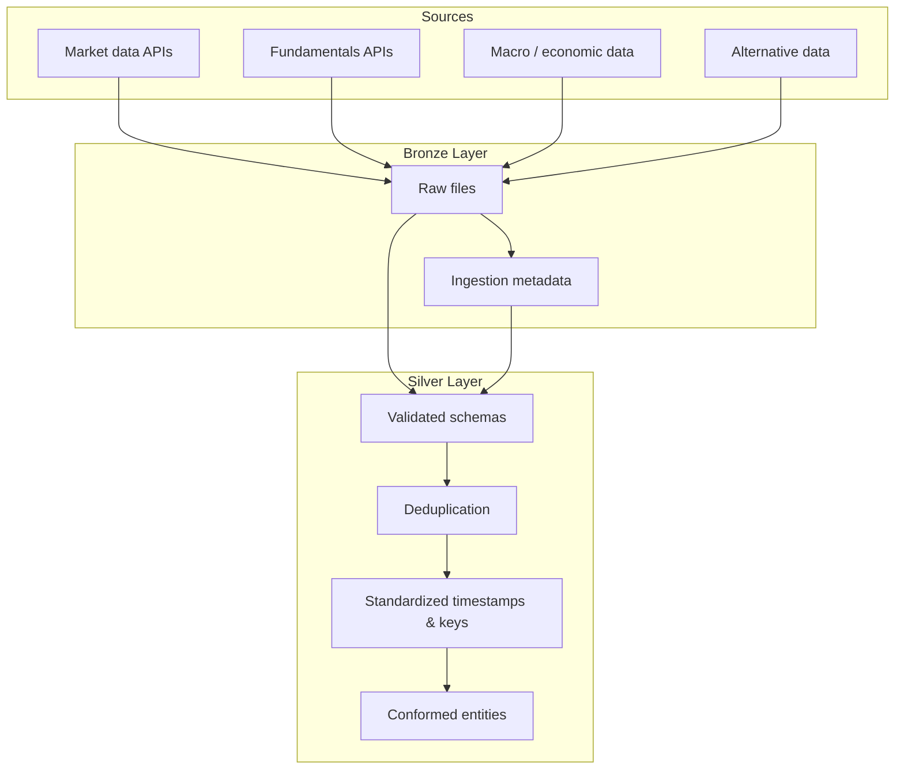

# SBFoundation: Bronze + Silver Data Acquisition Architecture

SBFoundation is a standalone data acquisition and validation package implementing the first two layers of a medallion/lakehouse architecture: **Bronze** (raw ingestion) and **Silver** (validated, conformed datasets). Downstream layers (Gold, Consumers) are handled by separate systems.

> **Data becomes more structured and trusted as it progresses from Bronze → Silver.**

### Why the Architecture Works

* **Separation of concerns** — ingestion and cleansing remain isolated
* **Reproducibility** — historical data can be replayed when logic changes
* **Auditability** — full lineage from Silver back to raw vendor payloads
* **Interoperability** — Silver outputs are stable inputs for any downstream consumer

### Layered Responsibilities

| Layer                          | Purpose             | Description                                                                                                   |
|--------------------------------|---------------------|---------------------------------------------------------------------------------------------------------------|
| **Bronze (Raw / Landing)**     | Ingest & Preserve   | Captures data exactly as received from source systems. Append-only, immutable, and fully traceable.           |
| **Silver (Clean / Conformed)** | Clean & Standardize | Applies validation, normalization, deduplication, and standardization to produce reliable, reusable datasets. |

## 1. Data Acquisition (Bronze Layer)

Data quality failures most often originate at ingestion, when data is prematurely transformed and original context is lost. The **Bronze layer** exists to prevent this failure mode by serving as the **system of record** for all incoming data.

**Bronze layer definition:**
Raw data is captured exactly as received from source systems and stored durably, immutably, and with full fidelity.

**Key properties:**

* Minimal or no transformation
* Lenient schema handling
* Errors, gaps, duplicates, and inconsistencies preserved rather than corrected

### What Belongs in Bronze

| Category     | Examples                                                                         |
|--------------|----------------------------------------------------------------------------------|
| **Included** | Raw API responses (JSON), vendor CSV extracts, event streams, ingestion metadata |
| **Excluded** | Business logic, derived metrics, aggregations, data quality corrections          |

When Silver logic changes, Bronze enables deterministic replay without re-pulling external data.

### Ingested Data Domains

* **Fundamentals** — balance sheets, income statements, cash flows, earnings
* **Market Data** — prices, yields, volatility, volume, dividends, open interest, order activity
* **Analytical Data** — analyst recommendations, ratings, forecasts
* **Alternative Data** — news, sentiment, macro indicators

## 2. Preprocessing & Validation (Silver Layer)

Raw data is inconsistent, incomplete, and unsuitable for direct analytical use. The **Silver layer** transforms Bronze data into a clean, standardized, and semantically consistent form.

**Silver layer definition:**
Bronze data is validated, normalized, deduplicated, enriched, and conformed to canonical representations, producing trusted analytical datasets.

**Key responsibilities:**

* Schema enforcement and type casting
* Timestamp alignment and timezone normalization
* Deduplication and late-arrival handling
* Corporate action adjustments (splits, dividends)
* Cross-source entity resolution

Outputs remain non-aggregated and reusable across multiple downstream use cases.

> Note: the current ingestion pipeline focuses on normalization and schema alignment; some responsibilities like deduplication and corporate-action adjustments are planned but not enforced everywhere yet.

### Final Note

This structure establishes **clear ownership and strong isolation between ingestion and validation**—from raw data acquisition through conformed Silver datasets ready for downstream consumption.
