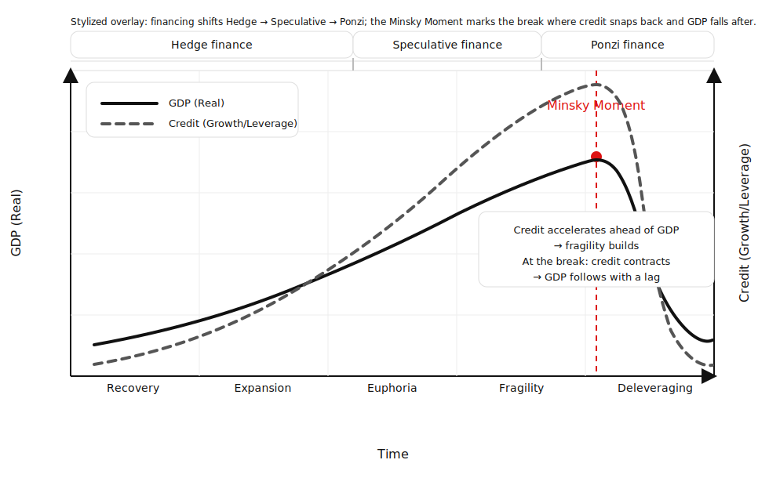

## The Hyman Minsky Financial Instability Hypothesis

**Hyman Minsky** was a post-Keynesian economist best known for the **Financial Instability Hypothesis (FIH)**. At its core, the model explains how credit cycles evolve and why capitalist economies are prone to recurring crises.

The following chart shows the U.S. high-yield (junk) bond default rate from 1972 to 2024, overlaid with recession periods (yellow bands) as dated by the National Bureau of Economic Research.

The key message is cyclical:
* Default rates remain low for long stretches during benign credit environments
* They then spike sharply around recessions, often after years of credit expansion
* Peaks tend to cluster near or just after economic downturns, not during the boom itself

The red circles highlight recurring credit stress episodes, illustrating how financial fragility builds quietly and then releases abruptly—very much in line with Minsky-style dynamics. The data is sourced from Edward Altman, whose work on credit cycles and default risk is foundational in fixed-income and macro risk analysis.

> Credit looks safest for years—until it suddenly isn’t, and defaults surge in a concentrated burst around recessions.


---

## 1. The Core Insight

> **Periods of economic stability encourage risk-taking, leverage, and financial fragility.**

When the economy looks safe:

* lenders loosen standards
* borrowers take on more debt
* financial structures become increasingly fragile

Crises are not caused by *external shocks* — they are **built into the system**.

---

## 2. The Three Financing Regimes


Minsky classified borrowers by how they service debt:

### 1️⃣ Hedge Finance (Stable)

* Cash flows cover **interest + principal**
* Low leverage
* Conservative assumptions

➡️ Dominant **early in expansions**

---

### 2️⃣ Speculative Finance (Fragile)

* Cash flows cover **interest only**
* Principal must be rolled over
* Higher leverage

➡️ Common **mid-cycle**, when optimism rises

---

### 3️⃣ Ponzi Finance (Unstable)

* Cash flows cover **neither interest nor principal**
* Depends on **rising asset prices** or refinancing
* Extremely leverage-dependent

➡️ Dominant **late-cycle**, just before crisis

> The key danger: the system *gradually migrates* from Hedge → Speculative → Ponzi without anyone explicitly deciding to do so.

---

## 3. The Minsky Cycle (Step-by-Step)

1. **Recovery** – Low leverage, cautious lending
2. **Boom** – Profits rise, confidence grows
3. **Euphoria** – Credit expands, asset prices surge
4. **Over-leveraging** – Ponzi finance spreads
5. **Minsky Moment** – A trigger causes credit contraction
6. **Crisis & Deleveraging** – Asset prices fall, defaults rise

The “**Minsky Moment**” is when markets suddenly realise that debts **cannot be serviced under current conditions**. A Minsky Moment is the point in a financial cycle when excessive leverage and speculative financing structures are exposed, causing a sudden shift from credit expansion to forced deleveraging.



---

## 4. Why This Matters for Markets

Minsky helps explain:

* credit bubbles
* asset price crashes
* sudden liquidity freezes
* why risk models fail in calm periods

Key takeaway:

> **Risk is lowest when it looks highest, and highest when it looks lowest.**

This directly challenges:

* Efficient Market Hypothesis
* Gaussian risk assumptions
* Static volatility models

---

## **5. Signals — What Data to Use (with FMP API Sources)**

To detect *credit cycle stress* and *Minsky-style regime shifts* using real data, combine **macro-economic indicators** with credit and financial market metrics. FMP provides useful endpoints for many of these inputs. ([Financial Modeling Prep][1])

### **5.A. Macro-Economic Signals**

These measure the overall state of the economy.

* **GDP Growth Rate** — Proxy for broad economic health and momentum
  *FMP endpoint:* `economic-indicators?name=GDP` for historical GDP levels and growth trends. ([Financial Modeling Prep][2])
* **Unemployment Rate** — Labor market slack; rising unemployment often leads recessions
  *FMP endpoint:* also available via the *Economic Indicators API* (e.g., `unemployment`). ([Financial Modeling Prep][2])
* **Inflation (CPI)** — Tightening inflation can presage tightening monetary conditions
  *FMP endpoint:* available via *Economic Indicators*. ([Financial Modeling Prep][2])
* **Interest Rates & Yield Data** — Duration risk and financing cost; higher yields tighten credit

*These macro indicators help establish where we are in the business cycle.*

---

## **5.B Credit & Financial Stress Signals (Data Sources + Costs)**

Credit stress is the core transmission mechanism in a **Minsky-style financial instability framework**.
The goal of this section is to capture **leverage build-up, liquidity tightening, and default risk** using a **tiered signal stack**, prioritizing **predictive power over availability**.

Signals are grouped by **structural lead time** and **data cost**.

---

### **Tier 1 — Structural Leverage & Fragility (Early-Warning Signals)**

*Slow-moving, highly predictive; ideal for regime detection*

| Signal                | Description                                                    | Data Source                                  | Cost     |
| --------------------- | -------------------------------------------------------------- | -------------------------------------------- | -------- |
| Credit-to-GDP Gap     | Deviation of credit from long-run trend; core crisis predictor | [Bank for International Settlements (BIS)](https://stats.bis.org/api/v1/data/CREDIT_GAP/Q.US.TOT_CREDIT_GAP?format=json)  | **Free** |
| Total Credit Growth   | Household + corporate credit expansion                         | **BIS**                                      | **Free** |
| Corporate Debt-to-GDP | System-wide leverage accumulation                              | **Federal Reserve Economic Data (FRED)**     | **Free** |
| Household Debt-to-GDP | Balance-sheet fragility in households                          | **FRED**                                     | **Free** |
| Flow of Funds (Z.1)   | Financial sector & non-financial leverage                      | **Federal Reserve**                          | **Free** |

**Usage:**
Primary inputs for **Hedge → Speculative → Ponzi regime classification**.
These signals move first and define **latent instability**.

---

### **Tier 2 — Market-Based Credit Stress (Timing & Acceleration)**

*Faster-moving, observable in real time*

| Signal                            | Description                                | Data Source                        | Cost     |
| --------------------------------- | ------------------------------------------ | ---------------------------------- | -------- |
| High-Yield OAS                    | Direct measure of credit risk repricing    | **FRED** (ICE BofA series)         | **Free** |
| Investment-Grade OAS              | Quality spread comparison                  | **FRED**                           | **Free** |
| Financial Conditions Index        | Composite of rates, spreads, equity stress | **FRED (Chicago / St. Louis Fed)** | **Free** |
| TED Spread                        | Liquidity & counterparty stress            | **FRED**                           | **Free** |
| High-Yield ETF Prices (HYG / JNK) | Market proxy for credit stress             | FMP / Yahoo / AV                   | **Free** |

**Usage:**
Detects **when fragility becomes actionable** and helps identify the **approach to the Minsky Moment**.

---

### **Tier 3 — Defaults & Credit Loss Confirmation (Late-Cycle)**

*Confirmatory, not predictive*

| Signal                  | Description                 | Data Source            | Cost              |
| ----------------------- | --------------------------- | ---------------------- | ----------------- |
| Corporate Default Rates | Aggregate realized defaults | **Moody’s Analytics**  | **$15k–$50k+/yr** |
| Rating Transitions      | Downgrade velocity          | **S&P Global Ratings** | **$20k–$75k+/yr** |
| Recovery Rates          | Loss severity post-default  | Moody’s / S&P          | **Paid**          |

**Usage:**
Used for **model validation, backtesting, and narrative confirmation**, not early warnings.

---

### **Tier 4 — Micro-Level Fragility (Optional, Bottom-Up)**

*High insight, high engineering cost*

| Signal                          | Description                    | Data Source   | Cost                        |
| ------------------------------- | ------------------------------ | ------------- | --------------------------- |
| Debt Maturity Walls             | Refinancing dependency         | **SEC EDGAR** | **Free (engineering cost)** |
| Interest Coverage Deterioration | Cash-flow stress               | EDGAR         | **Free**                    |
| Covenant Weakening              | Ponzi-style financing behavior | EDGAR         | **Free**                    |

**Usage:**
Firm-level Ponzi detection aggregated into macro fragility scores.

---

## **Recommended Minimum Stack (Cost = $0)**

A robust 5.B implementation **does not require paid data**.

**Baseline (strongly recommended):**

* BIS Credit-to-GDP gap
* FRED High-Yield OAS
* FRED Financial Conditions Index
* Corporate & household debt metrics
* High-yield ETF price proxies

This captures **80–90% of the informational content** needed for Minsky-style regime detection.

---

## **Signal Mapping to Minsky Regimes**

| Regime            | Observable Signal Pattern                                             |
| ----------------- | --------------------------------------------------------------------- |
| **Hedge**         | Credit growth ≈ GDP growth, tight spreads, stable leverage            |
| **Speculative**   | Credit growth > GDP, spreads compress, leverage rising                |
| **Ponzi**         | Credit-to-GDP gap elevated, liquidity tightens, spreads widen rapidly |
| **Minsky Moment** | Credit snaps back → GDP contracts with lag                            |

---

## **Implementation Guidance**

* **Silver layer:** raw macro, credit, and market series
* **Gold layer:** composite *Credit Fragility Index* and regime classification
* **Consumers:** exposure throttling, defensive allocation, risk overlays

> **Principle:**
> *Leverage builds quietly; stress appears suddenly; defaults come last.*


---

### **5.C. Market Sentiment & Price Signals**

These complement fundamental/credit data.

* **Equity Prices & Volatility:**
  Historical price data from *Historical Price APIs* (e.g., SP500 or sector indices) helps detect shifts in market risk appetite. ([Financial Modeling Prep][5])
* **Sector Rotation or Defensive Flows:**
  Sector valuations and inter-market spreads (e.g., financials vs. utilities) can signal risk regime changes.

---

Below is an **updated “Putting It Together” section** that is fully aligned with the **new 5.B data sources and cost tiers**.
This is written as a **drop-in replacement** you can paste directly under Section 5.B.

---

## **6. Putting It Together — Credit Fragility Signal Stack**

The objective is not to predict recessions directly, but to **identify when the financial system transitions from resilient to fragile**, consistent with **Minsky-style dynamics**.

This is achieved by **layering slow-moving structural indicators with fast-moving market stress signals**, and treating defaults as confirmation rather than prediction.

---

### **6.1. Signal Architecture (End-to-End)**

The system is built as a **tiered signal stack**, where each layer answers a different question:

| Question                           | Signal Tier           | Role                  |
| ---------------------------------- | --------------------- | --------------------- |
| *Is leverage building?*            | Tier 1 — Structural   | Early warning         |
| *Is stress emerging?*              | Tier 2 — Market-based | Timing & acceleration |
| *Has damage occurred?*             | Tier 3 — Defaults     | Confirmation          |
| *Where is fragility concentrated?* | Tier 4 — Micro        | Diagnostics           |

---

### **6.2. Core Inputs by Tier**

#### **Tier 1 — Structural Fragility (Lead Indicators)**

Primary source of regime shifts.

* Credit-to-GDP gap (**BIS**)
* Corporate & household debt-to-GDP (**FRED**)
* Flow of Funds leverage (**Federal Reserve Z.1**)

**Interpretation:**
If leverage grows faster than the real economy for a sustained period, the system is **transitioning from Hedge to Speculative finance**.

---

#### **Tier 2 — Credit Stress & Liquidity (Timing Indicators)**

Identifies when fragility becomes actionable.

* High-yield & investment-grade OAS (**FRED / ICE BofA**)
* Financial Conditions Index (**FRED**)
* TED spread (**FRED**)
* High-yield ETF prices (HYG / JNK as proxies)

**Interpretation:**
Rapid spread widening or liquidity tightening signals the **approach to a Minsky Moment**.

---

#### **Tier 3 — Defaults (Lagging Confirmation)**

Used to validate regimes, not trigger them.

* Aggregate default rates (Moody’s / S&P – optional, paid)

**Interpretation:**
Defaults confirm that the system has entered **full deleveraging**, typically after GDP has already rolled over.

---

#### **Tier 4 — Micro-Level Fragility (Optional Enhancements)**

* Debt maturity concentration
* Interest coverage deterioration
* Refinancing dependence (EDGAR)

**Interpretation:**
Identifies **Ponzi finance behavior** at the firm level and explains *where* stress will surface first.

---

### **6.3. Composite Credit Fragility Index (Conceptual)**

All tiers feed a single **Credit Fragility Index (CFI)**:

```
CFI = w1·Structural_Leverage
    + w2·Market_Stress
    + w3·Liquidity_Tightness
```

Where:

* **Structural_Leverage** = normalized BIS + debt-to-GDP metrics
* **Market_Stress** = normalized credit spreads + HY price stress
* **Liquidity_Tightness** = FCI + TED spread

Weights are **state-dependent**, increasing emphasis on market stress late-cycle.

---

### **4. Mapping Signals to Minsky Regimes**

| Regime            | Structural  | Market Stress    | Defaults  |
| ----------------- | ----------- | ---------------- | --------- |
| **Hedge**         | Low, stable | Tight spreads    | Low       |
| **Speculative**   | Rising      | Compressed       | Low       |
| **Ponzi**         | Elevated    | Widening rapidly | Still low |
| **Minsky Moment** | High        | Spikes           | Rising    |
| **Deleveraging**  | Falling     | Elevated         | High      |

**Key insight:**

> Defaults are the *end* of the process, not the warning.

---

### **6.5. Practical Use in the Platform**

* **Silver layer:**
  Store raw BIS, FRED, ETF, and Flow-of-Funds series.

* **Gold layer:**

  * Credit Fragility Index
  * Regime classification (Hedge / Speculative / Ponzi)
  * Transition probabilities

* **Consumers:**

  * Risk exposure caps
  * Defensive allocation switches
  * Volatility & leverage throttles

---


### **7. How These Feed a Minsky-Style Fragility Signal**

* **Early Cycle (“Hedge”)** — GDP growing, unemployment falling, credit spreads tight, leverage stable
  → signals: GDP↑, spreads flat, ratios within historical ranges.
* **Mid Cycle (“Speculative”)** — leverage rising, liquidity loosening, credit prices diverging from fundamentals
  → signals: leverage up, current ratios falling, high-yield index weakening vs broad market.
* **Late Cycle (“Ponzi”)** — macro weakens while credit stress rises sharply
  → signals: GDP deceleration → stagnation, spreads widen fast, high-yield drops sharply.

---

[1]: https://site.financialmodelingprep.com/datasets/economics?utm_source=chatgpt.com "Economics Data APIs | Indicators, Rates & Calendar... | FMP"
[2]: https://site.financialmodelingprep.com/developer/docs/stable/economics-indicators?utm_source=chatgpt.com "Economics Indicators API"
[3]: https://site.financialmodelingprep.com/developer/docs/stable/index-historical-price-eod-full?utm_source=chatgpt.com "Historical Index Full Chart API - Financial Modeling Prep"
[4]: https://site.financialmodelingprep.com/developer/docs/stable/metrics-ratios?utm_source=chatgpt.com "Financial Ratios API"
[5]: https://site.financialmodelingprep.com/datasets/market-data-historic?utm_source=chatgpt.com "Historical Market Data APIs | FMP - Financial Modeling Prep"


---

## 8. How Minsky Fits Medalion Architecture

In a **Bronze → Silver → Gold** analytics pipeline, Minsky logic naturally lives in **Gold**:

* **Silver:** credit growth, leverage ratios, spreads
* **Gold:** regime classification (Hedge / Speculative / Ponzi), fragility scores
* **Consumers:** risk throttles, exposure caps, defensive allocation switches

It’s a *state-of-the-system* model, not a point forecast.

---

## Bottom Line

Minsky’s model says financial crises are:

* **inevitable**
* **endogenous**
* **cyclical**
* **credit-driven**

