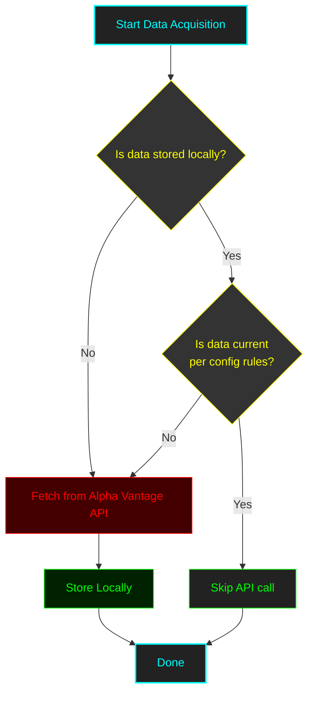
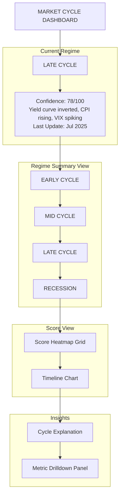

This document outlines key market cycle detection metrics organized by **epic (signal type)** with full user stories, data specs, scoring models, and Alpha Vantage endpoints.


## EPIC 1: Cycle-Sensitive Macroeconomic Indicators

> **Goal:** Detect expansions, contractions, and inflection points in the macro environment.

### 1.1 ISM Manufacturing PMI

> As a **quantitative analyst**, **I want to** monitor the ISM PMI monthly **So that** I can detect manufacturing-led expansions or contractions early.

**Acceptance Criteria:**

| Field             | Value                                  |
|-------------------|----------------------------------------|
| **Frequency**     | Monthly                                |
| **Input Column**  | `ISM_PMI`                              |
| **Output Column** | `ISM_PMI_Score`                        |
| **Formula**       | Raw value from ISM PMI                 |
| **Scoring**       | 40 → 60 maps to 0–100, ascending       |
| **Alpha Vantage** | `function=ISM_MANUFACTURING`           |
| **Release Date**  | 1st business day of each month         |

### Indicative Data Load Process




### 1.2 GDP Growth (QoQ Annualized)

As a **quantitative analyst**, **I want to** track quarterly GDP growth **So that** I can detect macro turning points.

**Acceptance Criteria:**

| Field             | Value                                  |
|-------------------|----------------------------------------|
| **Frequency**     | Quarterly                              |
| **Input Column**  | `GDP_Growth`                           |
| **Output Column** | `GDP_Growth_Score`                     |
| **Formula**       | Raw GDP growth                         |
| **Scoring**       | –5 → +5 maps to 0–100, ascending        |
| **Alpha Vantage** | `function=REAL_GDP`                    |
| **Release Date**  | End of month after quarter             |


### 1.3 Unemployment Rate

As a **quantitative analyst**, **I want to** monitor the unemployment rate **So that** I can measure labor market deterioration.

**Acceptance Criteria:**

| Field             | Value                                  |
|-------------------|----------------------------------------|
| **Frequency**     | Monthly                                |
| **Input Column**  | `Unemployment_Rate`                    |
| **Output Column** | `Unemployment_Score`                   |
| **Formula**       | Raw unemployment rate                  |
| **Scoring**       | 10 → 3 maps to 0–100, descending        |
| **Alpha Vantage** | `function=UNEMPLOYMENT_RATE`           |
| **Release Date**  | 1st Friday of each month               |


### 1.4 Consumer Confidence Index

As a **quantitative analyst**, **I want to** track consumer confidence to understand sentiment-driven spending trends.

**Acceptance Criteria:**

| Field             | Value                                  |
|-------------------|----------------------------------------|
| **Frequency**     | Monthly                                |
| **Input Column**  | `Consumer_Confidence`                  |
| **Output Column** | `Consumer_Confidence_Score`            |
| **Formula**       | Raw index value                        |
| **Scoring**       | 50 → 130 maps to 0–100, ascending       |
| **Alpha Vantage** | `function=CONSUMER_SENTIMENT`          |
| **Release Date**  | End of month                           |


### 1.5 Retail Sales (YoY)

As a **quantitative analyst**, **I want to** calculate YoY retail sales growth to gauge consumer demand trends.

**Acceptance Criteria:**

| Field             | Value                                |
|-------------------|----------------------------------------|
| **Frequency**     | Monthly                              |
| **Input Column**  | `Retail_Sales_YoY`                   |
| **Output Column** | `Retail_Sales_Score`                 |
| **Formula**       | YoY % change of retail sales         |
| **Scoring**       | –5 → +10 maps to 0–100, ascending     |
| **Alpha Vantage** | `function=RETAIL_SALES`              |
| **Release Date**  | Mid-month                            |


### 1.6 CPI Inflation (YoY)

As a **quantitative analyst**, **I want to** track YoY CPI inflation to identify mid-to-late cycle pressures.

**Acceptance Criteria:**

| Field             | Value                          |
|-------------------|----------------------------------------|
| **Frequency**     | Monthly                        |
| **Input Column**  | `CPI_YoY`                      |
| **Output Column** | `CPI_Score`                    |
| **Formula**       | YoY % change of CPI            |
| **Scoring**       | 8 → 1 maps to 0–100, descending |
| **Alpha Vantage** | `function=CPI`                 |
| **Release Date**  | Mid-month                      |


### 1.7 Yield Curve (10Y – 2Y Spread)

As a **quantitative analyst**, **I want to** compute and track the 10Y–2Y Treasury yield spread to detect potential recessions.

**Acceptance Criteria:**

| Field             | Value                          |
|-------------------|----------------------------------------|
| **Frequency**     | Weekly                         |
| **Input Column**  | `Yield_Spread`                 |
| **Output Column** | `Yield_Spread_Score`           |
| **Formula**       | `10Y_Yield - 2Y_Yield`         |
| **Scoring**       | –1 → +2 maps to 0–100, ascending |
| **Alpha Vantage** | `function=TREASURY_YIELD`      |
| **Release Date**  | Daily (sample weekly)          |


## EPIC 2: Market Internals

> **Goal:** Monitor price and volume-based signals that often move before macro indicators.


### 2.1 Advance/Decline Line

> **As a** quantitative analyst **I want to**** track the Advance/Decline (A/D) line **So that** I can assess market breadth and spot early warnings of internal weakness

> Use NYSE or S&P 500 Advance/Decline data as a broad market signal.

**Acceptance Criteria:**

| Field             | Value                                                 |
|-------------------|----------------------------------------|
| **Frequency**     | Daily/Weekly                                          |
| **Input Column**  | `AD_Line`                                             |
| **Output Column** | `AD_Score`                                            |
| **Formula**       | `#Advancers - #Decliners` (cumulative)                |
| **Scoring**       | Slope of A/D line, normalized to 0–100, **ascending** |
| **Alpha Vantage** | ❌ *Not directly available*                          |
| **Release Date**  | Daily — NYSE/market data feed                         |

**Why Daily Is the Right Frequency**

You’re building a **market cycle detection engine**, and the Advance/Decline Line is:

* A **breadth indicator**, not a trading signal
* Most meaningful at the **daily or weekly level**
* Used to detect *divergences* and internal market strength/weakness over time

**How to Build an A/D Line from Alpha Vantage**

1. **Choose the S&P 100 (manageable for API limits)

```python
tickers = [AAPL,ABBV,ABT,ACN,ADBE,AMD,AMGN,AMT,AMZN,AVGO  
        AXP,BA,BAC,BIIB,BK,BKR,BMY,BRK.B,C,CAT  
        CHTR,CL,CMCSA,COF,COP,COST,CRM,CSCO,CVS,CVX  
        DD,DE,DHR,DIS,DOW,DUK,EMR,EXC,F,FDX  
        GD,GE,GM,GOOGL,GS,HD,HON,IBM,INTC,JNJ  
        JPM,KHC,KMI,KO,LIN,LMT,LRCX,LOW,MA,MCD  
        MDLZ,MDT,MET,META,MMM,MO,MRK,MS,MSFT,NEE  
        NFLX,NKE,NOW,NVDA,ORCL,PEP,PFE,PG,PM,PYPL  
        QCOM,RTX,SBUX,SO,SPG,T,TMUS,TMO,TSLA,TXN  
        UNH,UNP,UPS,V,VZ,WBA,WFC,WMT,XOM,ZTS]
```

2. **Query each ticker’s daily close**

   ```bash
   https://www.alphavantage.co/query?function=TIME_SERIES_DAILY_ADJUSTED&symbol=AAPL&apikey=YOUR_KEY
   ```

3. **Parse the most recent two close prices**

4. **Classify each ticker** as:

   * **Advancer**: `close_today > close_yesterday`
   * **Decliner**: `close_today < close_yesterday`
   * **Unchanged**: ignore or count as neutral

5. **Aggregate**: `net_advances = advancers - decliners`

6. **Cumulatively sum** over time to produce the A/D line

**Sample Pseudocode**

```python

tickers = ['AAPL', 'MSFT', 'GOOGL', 'AMZN', 'META']  # replace with S&P 100
ts = TimeSeries(key='YOUR_API_KEY', output_format='pandas')

ad_data = []

for ticker in tickers:
    data, _ = ts.get_daily_adjusted(symbol=ticker, outputsize='compact')
    data = data.sort_index()
    try:
        latest = data.iloc[-1]['5. adjusted close']
        previous = data.iloc[-2]['5. adjusted close']
        ad_data.append(1 if latest > previous else -1 if latest < previous else 0)
    except:
        continue
    time.sleep(12)  # throttle to avoid API limit

net_ad = sum(ad_data)
```

### 2.2 % of Stocks Above 200-Day MA

> **As a** quantitative analyst
* ****I want to**** monitor what percentage of stocks are above their 200-day moving averages
* **So that** I can detect broad-based strength or weakness

**Acceptance Criteria:**

| Field             | Value                                                           |
|-------------------|----------------------------------------|
| **Frequency**     | Daily/Weekly                                                    |
| **Input Column**  | `Pct_Above_200DMA`                                              |
| **Output Column** | `Pct_Above_200DMA_Score`                                        |
| **Formula**       | `# stocks above 200DMA / total stocks`                          |
| **Scoring**       | min: 10%, max: 90%, **ascending**                               |
| **Alpha Vantage** | ❌ *Must calculate using `TIME_SERIES_DAILY_ADJUSTED` per stock* |
| **Release Date**  | Daily                                                           |

**How to Get the Data**

| Component       | Recommendation                                                                     |
| --------------- | ---------------------------------------------------------------------------------- |
| **Data Source** | Calculate using Alpha Vantage’s `TIME_SERIES_DAILY_ADJUSTED` for a list of tickers |
| **Free Option** | Use `yfinance` for a limited set (e.g. S\&P 100)                                   |
| **Premium**     | Use full index data from Polygon, Tiingo, or Barchart                              |
| **Processing**  | For each ticker: `200DMA = close.rolling(200).mean()`                              |
| **Output**      | `% = count(stocks_above_200dma) / total_stocks`                                    |
| **Frequency**   | Daily or weekly sampling                                                           |

**Sample Logic**

```python
above_200dma = [ticker for ticker in tickers if latest_price[ticker] > dma_200[ticker]]
pct_above = len(above_200dma) / len(tickers) * 100
```


### 2.3 VIX (Volatility Index)

> **As a** quantitative analyst
* ****I want to**** track the VIX index
* **So that** I can identify shifts in market fear or complacency

**Acceptance Criteria:**

| Field             | Value                                |
|-------------------|----------------------------------------|
| **Frequency**     | Daily                                |
| **Input Column**  | `VIX`                                |
| **Output Column** | `VIX_Score`                          |
| **Formula**       | Raw VIX index                        |
| **Scoring**       | min: 10, max: 60, **descending**     |
| **Alpha Vantage** | ❌ *Not available directly; use CBOE* |
| **Release Date**  | Real-time (CBOE)                     |

**How to Get the Data**

| Component         | Recommendation                                                                 |
| ----------------- | ------------------------------------------------------------------------------ |
| **Data Source**   | [CBOE VIX](https://www.cboe.com/us/futures/market_statistics/historical_data/) |
| **Free Option**   | Yahoo Finance: `^VIX` via `yfinance`                                           |
| **Premium**       | CBOE subscription (real-time) or Barchart.com                                  |
| **Alpha Vantage** | ❌ Not available                                                                |
| **Storage**       | Daily close values of VIX                                                      |

**Sample Logic**

```python
import yfinance as yf
vix_data = yf.download("^VIX", start="2020-01-01", end="today")
vix_score = scale_to_score(vix_data["Close"].iloc[-1], min_val=10, max_val=60, descending=True)
```


### 2.4 Credit Spreads (High Yield – Treasury)

> **As a** quantitative analyst
* ****I want to**** track high-yield vs Treasury yield spreads
* **So that** I can detect stress or tightening in credit markets

**Acceptance Criteria:**

| Field             | Value                                     |
|-------------------|----------------------------------------|
| **Frequency**     | Weekly                                    |
| **Input Column**  | `Credit_Spread`                           |
| **Output Column** | `Credit_Spread_Score`                     |
| **Formula**       | `HY_Corp_Yield – 10Y_Treasury_Yield`      |
| **Scoring**       | min: 0.5%, max: 6%, **descending**        |
| **Alpha Vantage** | ❌ *Requires external source (FRED / ICE)* |
| **Release Date**  | Weekly (usually Fridays)                  |


## EPIC 3: Valuation Indicators

> **Goal:** Identify regimes where the market may be overextended or undervalued over longer horizons.


### 3.1 Shiller CAPE Ratio

> **As a** quantitative analyst
* ****I want to**** evaluate long-term valuations using the CAPE ratio
* **So that** I can assess long-run expected returns

**Acceptance Criteria:**

| Field             | Value                                      |
|-------------------|----------------------------------------|
| **Frequency**     | Monthly                                    |
| **Input Column**  | `Shiller_CAPE`                             |
| **Output Column** | `CAPE_Score`                               |
| **Formula**       | Raw value                                  |
| **Scoring**       | min: 10, max: 40, **descending**           |
| **Alpha Vantage** | ❌ *Not supported* — use multpl.com or FRED |
| **Release Date**  | Monthly (delayed by a few weeks)           |


### 3.2 Forward P/E of S\&P 500

> **As a** quantitative analyst **I want to**** monitor forward P/E multiples **So that** I can spot valuation compression or expansion trends

**Acceptance Criteria:**

| Field             | Value                                |
|-------------------|----------------------------------------|
| **Frequency**     | Weekly/Monthly                       |
| **Input Column**  | `Forward_PE`                         |
| **Output Column** | `Forward_PE_Score`                   |
| **Formula**       | Raw P/E                              |
| **Scoring**       | min: 10, max: 25, **descending**     |
| **Alpha Vantage** | ❌ *Not available — use FactSet/S\&P* |
| **Release Date**  | Weekly (FactSet); Monthly (S\&P)     |


### 3.3 Market Cap to GDP ("Buffett Indicator")

> **As a** quantitative analyst **I want to**** compare total market cap to GDP **So that** I can assess extreme over- or undervaluation levels

**Acceptance Criteria:**

| Field             | Value                                                |
|-------------------|----------------------------------------|
| **Frequency**     | Quarterly                                            |
| **Input Column**  | `MarketCap_GDP`                                      |
| **Output Column** | `Buffett_Score`                                      |
| **Formula**       | `Total Market Cap / Nominal GDP`                     |
| **Scoring**       | min: 0.7, max: 2.0, **descending**                   |
| **Alpha Vantage** | ❌ *Requires total market cap + GDP (FRED + YCharts)* |
| **Release Date**  | Quarterly                                            |


## EPIC 4: Sentiment & Positioning

> **Goal:** Spot emotional extremes and crowd positioning that signal reversals.


### 4.1 AAII Sentiment Survey

> **As a** quantitative analyst **I want to**** track the AAII bull-bear spread **So that** I can fade extreme sentiment

**Acceptance Criteria:**

| Field             | Value                                  |
|-------------------|----------------------------------------|
| **Frequency**     | Weekly                                 |
| **Input Column**  | `AAII_Spread`                          |
| **Output Column** | `AAII_Score`                           |
| **Formula**       | `Bull % – Bear %`                      |
| **Scoring**       | min: –40, max: +40, **mean-reverting** |
| **Alpha Vantage** | ❌ *Must scrape from AAII site*         |
| **Release Date**  | Weekly (Thursdays)                     |


### 4.2 Put/Call Ratio

> **As a** quantitative analyst **I want to**** track the CBOE equity put/call ratio **So that** I can spot fear vs greed sentiment

**Acceptance Criteria:**

| Field             | Value                                  |
|-------------------|----------------------------------------|
| **Frequency**     | Daily                                  |
| **Input Column**  | `PutCall_Ratio`                        |
| **Output Column** | `PutCall_Score`                        |
| **Formula**       | Raw ratio                              |
| **Scoring**       | min: 0.4, max: 1.2, **mean-reverting** |
| **Alpha Vantage** | ❌ *Use CBOE or FRED data*              |
| **Release Date**  | Daily                                  |


### 4.3 Fund Manager Survey (BofA Global Fund Manager Survey)

> **As a** quantitative analyst **I want to** track institutional positioning and risk appetite via the Fund Manager Survey **So that** I can identify excessive risk-on or risk-off sentiment among professional investors

**Acceptance Criteria:**

| Field             | Value                                                              |
|-------------------|----------------------------------------|
| **Frequency**     | Monthly                                                            |
| **Input Column**  | `Fund_Manager_Risk_Exposure`                                       |
| **Output Column** | `Fund_Manager_Score`                                               |
| **Formula**       | % of managers overweight equities or cash                          |
| **Scoring**       | 0%–100%, **mean-reverting**                                        |
| **Alpha Vantage** | ❌ *Not available — must pull from BofA PDF or secondary data feed* |
| **Release Date**  | Mid-month (typically around the 3rd week)                          |


## EPIC 5: Leading Indicator Composites

> **Goal:** Track indexes that combine multiple forward-looking signals.

### 5.1 Conference Board LEI

> **As a** quantitative analyst **I want to**** track the U.S. Leading Economic Index **So that** I can anticipate economic slowdowns

**Acceptance Criteria:**

| Field             | Value                                                |
|-------------------|----------------------------------------|
| **Frequency**     | Monthly                                              |
| **Input Column**  | `LEI`                                                |
| **Output Column** | `LEI_Score`                                          |
| **Formula**       | % change MoM or YoY                                  |
| **Scoring**       | Positive = high score, negative = low, **ascending** |
| **Alpha Vantage** | ❌ *Must pull from Conference Board*                  |
| **Release Date**  | Around the 20th of each month                        |

### 5.2 OECD Composite Leading Indicator**

> **As a** quantitative analyst ***I want to**** track global composite leading indicators **So that** I can adjust exposure based on international cycle changes

**Acceptance Criteria:**

| Field             | Value                             |
|-------------------|----------------------------------------|
| **Frequency**     | Monthly                           |
| **Input Column**  | `OECD_CLI`                        |
| **Output Column** | `OECD_CLI_Score`                  |
| **Formula**       | % deviation from long-term trend  |
| **Scoring**       | –2% to +2% = 0–100, **ascending** |
| **Alpha Vantage** | ❌ *Use OECD API or FRED*          |
| **Release Date**  | Monthly (1–2 month lag)           |

Absolutely — here’s a well-structured **Epic** that covers the UI/UX work for integrating your metrics into a **Market Cycle Dashboard**, with regime classification and visual cues for user interpretation.


## EPIC 6: Market Cycle Dashboard UI

> **Goal:** Present a unified, visual dashboard that summarizes all cycle metrics and clearly communicates the current market regime.

> As a **quantitative analyst**, I want to view a **Market Cycle Dashboard** that aggregates all scored indicators So that I can **quickly assess** where we are in the macro cycle and adjust strategy accordingly.

### Acceptance Criteria

* ✅ Display a **summary view** of current scores across all metrics grouped by signal type
* ✅ Visually indicate the **current market regime** (Early, Mid, Late, Recession) using:

  * Color-coded regime cards
  * Historical regime transitions (timeline/chart)
  * Confidence score or probability (if model-driven)
* ✅ Provide **tooltip explanations** for each regime signal (e.g., “PMI rising = early cycle”)
* ✅ Offer a **drill-down panel** for each metric with:

  * Current score
  * Trend chart (3–12 months)
  * Last release date and source
* ✅ Include a **regime classification engine output** (deterministic or ML-based) with inputs:

  * Aggregated composite score
  * Top contributing indicators
  * Threshold logic per regime


### Regime Definitions (for logic layer & UI labels)

| **Regime**      | **Leading Signals**                                            |
|  | -- |
| **Early Cycle** | Rising PMI, improving earnings, steepening yield curve         |
| **Mid Cycle**   | Strong GDP & employment, valuations stretched                  |
| **Late Cycle**  | Rising inflation, flattening/inverted yield curve              |
| **Recession**   | Negative GDP, rising unemployment, volatility spike, rate cuts |


### UI Components to Build

| Component               | Purpose                                         |
| -- | -- |
| `RegimeHeaderCard`      | Show current regime + key signals               |
| `ScoreHeatmapGrid`      | Display normalized scores per metric            |
| `RegimeTimeline`        | Track historical regime classification changes  |
| `MetricDrilldownPanel`  | View source, formula, chart, and trend for each |
| `CycleExplanationModal` | Explain regime logic & transition signals       |


###  Output Examples

* **Current Market Cycle**: `Late Cycle`
* **Confidence Score**: `78/100`
* **Top Contributors**: Yield curve inverted, CPI rising, VIX spiking
* **Last Update**: July 2025, all data current


Let me know if you’d like a wireframe layout, React component structure, or integration plan into an existing analytics portal.


### Market Cycle Dashboard

```
+----------------------------------------------------------+
|                    MARKET CYCLE DASHBOARD                |
+----------------------------------------------------------+
|   [ LATE CYCLE ]                                         |
|   Confidence Score: 78/100                               |
|   Yield curve inverted, CPI rising, VIX spiking          |
|   Last Update: Jul 2025                                  |
+----------------------------------------------------------+

| EARLY CYCLE | MID CYCLE | LATE CYCLE | RECESSION |
+--------------------------------------------------+
|           Summary View of Cycle Regimes          |
+--------------------------------------------------+

+------------------------+-------------------------+
|   Score Heatmap Grid   |      Timeline Chart     |
|  +-----+-----+------+  |  ┌───────────────────┐  |
|  |  EC | MC  |  LC  |  |  │                   │  |
|  |-----|-----|------|  |  │   Regime Trend    │  |
|  |  REC| INF | VIX  |  |  │   Over Time →     │  |
|  +-----+-----+------+  |  └───────────────────┘  |
+------------------------+-------------------------+

+------------------------+-------------------------+
|     Cycle Explanation  |   Metric Drilldown Panel|
|  ┌───────────────────┐ |  +--------------------+ |
|  │ Early = PMI↑      │ |  |  CPI YoY: 6.2%     | |
|  │ Recession = GDP↓  │ |  |  Score: 22/100     | |
|  └───────────────────┘ |  |  Trend: ↘ 3 mo      | |
|       [Learn More]     |  +--------------------+ |
+------------------------+-------------------------+
```

Notes
-  replace "EC", "MC", "LC", "REC" in the heatmap grid with actual metric abbreviations.
- insert actual values into metric panels programmatically.



