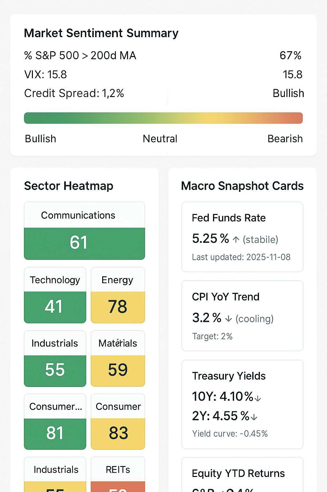

This is a **single-user, first-pass analytics platform**, where **all scoring is code-driven**, then the UI doesn’t need all the bells and whistles of a commercial screening product. It should instead serve as a **visual analytics dashboard** that helps *you* do three things quickly:

1. Gauge **overall market conditions** (macro + sentiment context)
2. View **fundamental & historical trend data per stock**
3. Compare **each stock against its sector**
4. Display **your code-generated scores and metrics** clearly

Let’s strip it back and rework the UX/UI around *you* and *your dividend-growth scoring workflow*.

## **Home Dashboard (Market Overview)**

**Purpose:** Give you a pulse on the market’s position in the bull/bear cycle and key macro indicators.

**UI Elements:**

* **Market Sentiment Summary Card:**

  * Displays metrics:

    * % of S&P 500 above 200-day MA
    * VIX level
    * Credit spreads or risk-on/risk-off ratio
    * Yield curve spread (10Y-2Y)
  * Visual indicator (gauge or bar) for *Bullish → Neutral → Bearish*
* **Sector Heatmap:**

  * Sector-level average scores (your scoring system’s output)
  * Colored by strength (green strong → red weak)
* **Macro Snapshot Cards:**

  * Fed Funds Rate trend
  * CPI YoY trend
  * Treasury yield changes
  * Equity index returns YTD

**Goal:** Let you know *what kind of market you’re scoring into* before diving into stock-level analysis.
```text
                           🧭 MARKET OVERVIEW DASHBOARD                           

MARKET SENTIMENT SUMMARY                                                         
   ┌────────────────────────────────────────────────────────────────────────────┐  
   |  % S&P 500 > 200d MA: 67%       VIX: 15.8      Credit Spread: 1.2%         |  
   |  Yield Curve (10Y-2Y): -0.45%                                              |  
   |                                                                            |  
   |  Market Regime Gauge: [■■■■■■■■■■■■■■■■■■■■■■■■■■■■■■■■■■] 🟩 Bullish     |  
   └────────────────────────────────────────────────────────────────────────────┘  

 SECTOR HEATMAP 
   ┌──────────────────────────────────────────────────────────────────────────────┐  
   |  COMMUNICATIONS   TECHNOLOGY   ENERGY   FINANCIALS   HEALTHCARE   UTILITIES  |  
   |      🟩 82            🟨 62    🟥 41    🟩 78        🟩 80        🟧 55   |
   |  INDUSTRIALS      MATERIALS    CONSUMER DISC.   CONSUMER STAP.   REITS       |  
   |      🟩 77            🟨 59       🟩 81           🟩 83        🟧 53       |
   └──────────────────────────────────────────────────────────────────────────────┘  

 MACRO SNAPSHOT CARDS 
  ┌───────────────────┐  ┌──────────────────┐  ┌────────────────────┐  ┌──────────────┐ 
  | FED FUNDS RATE    |  | CPI YOY TREND    |  |TREASURY YIELDS     |  |EQUITY YTD    | 
  |  5.25% ↗ (stable) |  |  3.2% ↘ cooling |  | 10Y: 4.10% ↘       |  |  S&P: +9.4%  | 
  |  (last updated)   |  |  Inflation vs.   |  | 2Y: 4.55% ↘        |  | NASDAQ:+14%  | 
  |  2025-11-08       |  |  target (2%)     |  | Yield curve:-0.45% |  | Dow: +6.2%   |
  └───────────────────┘  └──────────────────┘  └────────────────────┘  └──────────────┘ 
```

## **Stock Explorer (Main Workspace)**

**Purpose:** View, search, and rank your universe of stocks based on your precomputed scores.

**Layout:**

* **Left Sidebar:**

  * Ticker search
  * Sector filter
  * Option to sort by score, yield, or growth rate
* **Main Table:**

  * Columns: Ticker, Company, Sector, Dividend Score, Value Score, Quality Score, Yield, Dividend Growth %, Payout Ratio, 5Y CAGR
  * Each row expands to show mini time-series charts (TTM Revenue, EPS, Dividend)
* **Top Summary Bar:**

  * Universe stats: median score, sector leaders, % above 50DMA

**UX Notes:**

* No interactive scoring — all data read-only from your computed tables.
* Fast sort/filter interactions with caching (since it’s local and single-user).
* Optional “favorites” or “watchlist” toggle.


## 🧮 3. **Stock Detail View**

**Purpose:** Deep-dive into a single stock — fundamentals, dividend history, and sector-relative positioning.

**Sections:**

### ① Overview Tab

* Snapshot cards: Dividend yield, payout ratio, EPS growth, Dividend growth (TTM, 3Y, 5Y)
* Your computed **Dividend Score breakdown**
* Line chart: Dividend per share vs. EPS over time
* Sparkline or bullet chart for valuation trend (P/E, P/B, EV/EBITDA)

### ② Fundamentals History

* Multi-series line chart (Revenue, EPS, FCF, Dividends per share)
* Ratio panel (ROE, ROA, Debt/Equity, Interest Coverage)
* Toggle for TTM, YoY, or 5Y averages

### ③ Sector Comparison

* Peer comparison chart:

  * X-axis: Dividend Yield
  * Y-axis: Dividend Growth Rate
  * Bubble size: Market Cap
  * Highlight this stock vs. peers (e.g., “blue = your stock, gray = sector peers”)
* Sector median and quartile overlays

### ④ Historical Scoring

* Trend line for your computed score over time (so you can see consistency or divergence)


## 📊 4. **Market Context Page**

**Purpose:** Quantify and visualize *where the market sits* on the bull/bear spectrum.

**Components:**

* **Composite Market Condition Index:**

  * Derived from your macro and breadth indicators (like % above MA, volatility, credit spread)
* **Time-series chart:**

  * Market condition index vs. S&P 500 performance
* **Breadth Metrics Heatmap:**

  * Sector-level breadth (advance/decline ratios, % above 50/200 MA)
* **Historical Zone Visualization:**

  * Plot “Bull → Neutral → Bear” regimes with shaded areas on a price chart

**Goal:** Quickly align your stock scoring interpretation with the broader regime (e.g., “I’m overweight dividend growth in a late-cycle bull”)


## ⚙️ 5. **Data & Model Summary Page**

**Purpose:** View metadata on scoring runs and data freshness.

**UI Components:**

* Table of last refresh per dataset (Income, Cashflow, BalanceSheet, Prices, Macros)
* List of score files loaded (DividendScore.json, ValueScore.json, etc.)
* Timestamps for last scoring run
* Option to trigger a manual refresh (if you build in that hook)


## 🧩 6. **Design Aesthetic**

**Tone:** Analytical, focused, minimalist.
You don’t need dashboard clutter — just clarity.

**Visual design cues:**

* **Framework:** Streamlit + ECharts (exactly what you’ve been using)
* **Color palette:** muted grays + sector-based accent colors (blue for financials, green for utilities, etc.)
* **Typography:** Inter or Roboto Mono
* **Layout:** Two-column (sidebar filters + main view), responsive for tablet use
* **Charts:** Recharts/ECharts line and scatter visuals with tooltips showing numeric values
* **State indicators:** Subtle transitions (fade or grow animations when loading new data)


## 🧠 7. Workflow Summary (User Journey)

1. **Open dashboard →** check market context (macro + sector heatmap)
2. **Go to Stock Explorer →** see universe sorted by your latest Dividend Score
3. **Select stock →** review fundamentals, dividend trends, and sector-relative performance
4. **Interpret scores** in light of market conditions (bull vs. bear regime)
5. **Optionally export** filtered data for deeper analysis or model tweaks


Would you like me to mock up (visually) what this UI would look like — say, a **Streamlit-style first-pass layout** showing these pages and their components (in code or a diagram)?
That would help you see what the MVP app might actually look like in practice.
