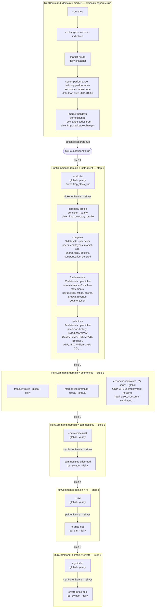

# ExecPlan: Comprehensive Domain Documentation Implementation

**Version**: 1.0
**Created**: 2026-02-18
**Status**: Draft - Pending Approval

---

## Purpose / Big Picture

Create comprehensive, user-facing documentation for all SBFoundation data domains (instrument, company, fundamentals, technicals, economics, market, commodities, FX, crypto) to enable users to:

1. Understand what data is available in each domain
2. Know the purpose and refresh cadence of each dataset
3. Find API endpoint documentation quickly
4. Understand domain execution order and dependencies
5. Navigate the codebase efficiently when debugging or extending datasets

This work will produce a centralized, authoritative reference document (`docs/domain_datasets_reference.md`) that is linked from the README.md and serves as the single source of truth for dataset capabilities.

**User-visible outcome**: Users can answer "What economic indicators does SBFoundation ingest?" or "How often is company profile data refreshed?" without reading YAML or code.

---

## Progress

- [x] Review existing prompt files (crypto.md, fx.md, markets.md, commodities.md) - 2026-02-18
- [x] Create instrument.md prompt file - 2026-02-18
- [x] Create company.md prompt file - 2026-02-18
- [x] Create fundamentals.md prompt file - 2026-02-18
- [x] Create technicals.md prompt file - 2026-02-18
- [x] Create economics.md prompt file - 2026-02-18
- [x] Review all prompt files for duplicates - 2026-02-18
- [x] Delete old instruments.md file (contained duplicates and wrong names) - 2026-02-18
- [x] Create comprehensive docs/domain_datasets_reference.md - 2026-02-18
- [x] Update README.md to reference new documentation - 2026-02-18
- [x] Verify all datasets in dataset_keymap.yaml are documented - 2026-02-18
- [x] Add domain execution order diagram - 2026-02-18
- [ ] Add dataset dependency graph
- [ ] Test documentation accuracy against dataset_keymap.yaml
- [ ] Peer review for completeness

---

## Surprises & Discoveries

### 2026-02-18: Prompt File Patterns
- Existing prompt files (crypto.md, fx.md, markets.md, commodities.md) follow a consistent structure but are implementation guides, not user documentation
- They focus on what needs to be built rather than what exists
- New prompt files created for instrument, company, fundamentals, technicals, and economics domains
- Economics domain has 15 different economic indicators using discriminators
- Fundamentals domain has extensive coverage (25+ datasets) with both annual and quarterly periods
- Technicals domain includes multiple moving average types (SMA, EMA, WMA, DEMA, TEMA) with various periods

### 2026-02-18: Dataset Keymap Complexity
- dataset_keymap.yaml is 66,342 tokens (too large to read in one pass)
- Uses discriminators extensively for shared datasets (e.g., income-statement with "FY" and "quarter")
- Some datasets have both annual and quarterly versions with same dataset name but different discriminators
- Economic indicators share one dataset name with 15+ discriminators

### 2026-02-18: Old instruments.md File Removed
**Problem**: Found duplicate and conflicting dataset definitions in old `docs/prompts/instruments.md` (note: plural)
- Mixed datasets from multiple domains (instrument + company) in one file
- Used incorrect dataset names not matching dataset_keymap.yaml:
  - `company-stock-peers` (should be `company-peers`)
  - `company-delisted-companies` (should be `company-delisted`)
  - `company-historical-employee-count` (should be `company-employees`)
- Included non-existent dataset: `financial-statement-symbol-list` (not in keymap)
- Created duplicates with new domain-specific files

**Resolution**: Deleted `docs/prompts/instruments.md` (old file)
- All instrument domain datasets now properly documented in `docs/prompts/instrument.md` (singular, new)
- All company domain datasets now properly documented in `docs/prompts/company.md` (new)
- Dataset names now match dataset_keymap.yaml exactly
- No duplicates remain across all prompt files

**Verification**: Reviewed all 9 prompt files (instrument, company, fundamentals, technicals, economics, crypto, fx, commodities, markets) - each dataset appears exactly once with correct naming

---

## Decision Log

### Decision 1: Create Prompt Files First (2026-02-18)
**Rationale**: Existing pattern in repo shows prompt files (crypto.md, fx.md, etc.) serve as implementation guides. Creating these for remaining domains provides a foundation for comprehensive documentation.
**Alternative considered**: Skip prompt files and go straight to user documentation
**Why rejected**: Prompt files serve a different purpose (implementation guides) than user docs (reference material)

### Decision 2: Separate User Documentation from Prompt Files (2026-02-18)
**Rationale**: Prompt files are for implementers; user documentation should be separate and focus on capabilities, not implementation tasks
**Location**: `docs/domain_datasets_reference.md`
**Why this approach**: README.md already has embedded docs for crypto/fx/commodities; centralizing all domain docs in one reference file creates a single source of truth

### Decision 3: Document All 9 Domains (2026-02-18)
**Domains**: instrument, company, fundamentals, technicals, economics, market, commodities, FX, crypto
**Rationale**: Complete coverage prevents confusion; some domains (market) were missing prompt files
**Format**: Consistent structure across all domains for easy navigation

### Decision 4: Delete Old instruments.md File (2026-02-18)
**Rationale**: During duplicate review, discovered `docs/prompts/instruments.md` (plural) contained:
- Datasets from multiple domains mixed together (violated domain separation principle)
- Incorrect dataset names that don't match dataset_keymap.yaml
- Non-existent dataset (financial-statement-symbol-list)
- Duplicates with new domain-specific files (instrument.md, company.md)
**Alternative considered**: Archive the file or update it to match keymap
**Why rejected**: File structure was fundamentally flawed (mixed domains); cleaner to delete and rely on new domain-specific files
**Action taken**: Deleted file; all datasets now properly documented in domain-specific prompt files with correct names

---

## Outcomes & Retrospective

_To be completed after implementation_

---

## Context and Orientation

### Current State
- SBFoundation has 9 data domains defined in `src/sbfoundation/settings.py`
- Dataset configurations live in `config/dataset_keymap.yaml` (authoritative source)
- Some domains (crypto, fx, commodities, market) have prompt files in `docs/prompts/`
- Other domains (instrument, company, fundamentals, technicals, economics) lacked prompt files (now created)
- README.md has embedded documentation for crypto, fx, and commodities domains
- No centralized reference for all domain datasets

### Key Files
- `config/dataset_keymap.yaml` — authoritative dataset definitions
- `src/sbfoundation/settings.py` — domain, dataset, and constant definitions
- `README.md` — project overview with embedded crypto/fx/commodities docs
- `docs/prompts/*.md` — implementation guides for specific domains
- `CLAUDE.md` — project context and constraints (Section 4: Canonical Definitions)

### Domain Execution Order

`DOMAIN_EXECUTION_ORDER` in `src/sbfoundation/settings.py` defines the canonical sequence. `SBFoundationAPI.run()` in `src/sbfoundation/api.py` dispatches each domain command; company, fundamentals, and technicals are executed internally within the `instrument` handler (no standalone API entry point for those three).



**Key rules captured in the diagram:**
- `instrument` must run first — it populates `silver.fmp_stock_list` which seeds the ticker universe for all per-ticker domains
- `company-profile` runs before the other company/fundamentals/technicals datasets because downstream DTOs may reference profile data
- Within each list-then-price-eod domain (commodities, fx, crypto), the list **must** load first — the price-eod step queries silver for the symbol universe
- `market-holidays` must run after `exchanges` because it reads exchange codes from `silver.fmp_market_exchanges`
- `economics` and `market` are globally scoped (no ticker dependency) and can be run independently

### Key Terms (from CLAUDE.md Section 4)
- **Instrument**: concrete tradeable representation of an asset (e.g., AAPL on NASDAQ)
- **Universe**: defined, versioned set of instruments for a strategy
- **Dataset**: structured collection of data with defined schema; immutable within a run
- **Feature**: measured property of an instrument at a specific time
- **Domain**: category of related datasets (instrument, company, fundamentals, etc.)

---

## Plan of Work

### Phase 1: Prompt Files (COMPLETED)
Created five new prompt files following the pattern from existing crypto.md, fx.md, markets.md, commodities.md:
1. ✅ `docs/prompts/instrument.md`
2. ✅ `docs/prompts/company.md`
3. ✅ `docs/prompts/fundamentals.md`
4. ✅ `docs/prompts/technicals.md`
5. ✅ `docs/prompts/economics.md`

### Phase 2: Comprehensive Domain Reference (TODO)
Create `docs/domain_datasets_reference.md` with the following structure:

```markdown
# SBFoundation Domain & Dataset Reference

## Overview
[Brief description of all 9 domains and their relationships]

## Domain Execution Order
[Diagram showing dependency flow: instrument → economics → company → fundamentals → technicals → commodities → fx → crypto]

## Instrument Domain
### Purpose
### Execution Phase
### Datasets
  #### stock-list
  - **Purpose**: ...
  - **Scope**: global | per_ticker
  - **Refresh**: min_age_days, run_days
  - **Silver Table**: ...
  - **Key Columns**: ...
  - **Endpoint**: ...
  - **Documentation**: [link]
  [... repeat for each dataset ...]

[... repeat for each domain ...]

## Dataset Summary Table
[Table with columns: Domain | Dataset | Scope | Refresh | Plans | Purpose]

## Quick Reference
- Total datasets: X
- Ticker-based datasets: Y
- Global datasets: Z
- Daily refresh datasets: A
- Weekly refresh datasets: B
```

### Phase 3: README.md Update (TODO)
Update README.md to:
1. Add reference link to `docs/domain_datasets_reference.md` in the "Overview" section
2. Keep existing embedded crypto/fx/commodities sections (or migrate to reference doc)
3. Add "Data Domains" section with brief summary and link to full reference
4. Update "Data domains ingested" table to include all 9 domains with links

### Phase 4: Verification (TODO)
1. Parse `config/dataset_keymap.yaml` and extract all dataset entries
2. Cross-reference with documentation to ensure 100% coverage
3. Verify all endpoint URLs match keymap `data_source_path`
4. Verify all `min_age_days` and `run_days` match keymap recipes
5. Verify all `key_cols` match keymap definitions

### Phase 5: Enhancement (TODO)
1. Add domain execution order diagram (text-based or mermaid)
2. Add dataset dependency graph showing which datasets depend on others
3. Add "Common Queries" section with SQL examples
4. Add "Troubleshooting" section for common dataset issues

---

## Concrete Steps

### Step 1: Create Domain Datasets Reference Document
```bash
# Create the reference document
touch docs/domain_datasets_reference.md
```

**Expected output**: Empty file created

### Step 2: Populate Reference Document Header
Write header section including:
- Title and purpose
- Last updated timestamp
- Quick navigation links to each domain
- Overview of all 9 domains
- Domain execution order

**Expected content**: ~200 lines covering overview and structure

### Step 3: Document Each Domain
For each of the 9 domains, add:
- Domain name and purpose
- Execution order position
- Ticker-based vs global scope
- List of all datasets with full details (purpose, scope, refresh, tables, keys, endpoints)

**Expected content**: ~1500-2000 lines total

**Source of truth**: `config/dataset_keymap.yaml` parsed entries

### Step 4: Add Summary Tables
Create summary tables:
- All datasets by domain
- All datasets by refresh frequency
- All datasets by FMP plan requirement
- All datasets by scope (ticker-based vs global)

**Expected content**: ~100 lines of tables

### Step 5: Update README.md
Edit README.md to:
```markdown
## Data Domains

SBFoundation ingests data across 9 domains in a specific execution order:

1. **Instrument** — Stock, ETF, index, crypto, and forex lists; ETF holdings
2. **Economics** — Macroeconomic indicators, treasury rates, market risk premium
3. **Company** — Company profiles, peers, employees, market cap, officers, compensation
4. **Fundamentals** — Financial statements, key metrics, ratios, growth rates, revenue segmentation
5. **Technicals** — Price history, moving averages, momentum indicators, volatility measures
6. **Commodities** — Commodity lists and historical prices
7. **FX** — Currency pair lists and exchange rates
8. **Crypto** — Cryptocurrency lists and historical prices
9. **Market** — Countries, exchanges, sectors, industries, performance metrics

**📖 For complete dataset details, see [Domain & Dataset Reference](docs/domain_datasets_reference.md)**
```

**Expected change**: Add ~15 lines to README.md, replace or augment existing "Data domains ingested" section

### Step 6: Verify Accuracy
```bash
# Parse keymap and extract dataset count
grep "^- domain:" config/dataset_keymap.yaml | wc -l

# Extract all unique datasets
grep "^  dataset:" config/dataset_keymap.yaml | sort | uniq | wc -l

# Verify documentation covers all
# (manual comparison between keymap entries and docs)
```

**Expected output**: Documentation should cover 100% of datasets in keymap

### Step 7: Test Documentation Navigation
Manually test:
- Links from README.md to domain_datasets_reference.md work
- Internal anchor links within domain_datasets_reference.md work
- All external FMP documentation links are valid
- All table formatting renders correctly in GitHub markdown

**Expected outcome**: All links work, formatting is clean

---

## Validation and Acceptance

### Acceptance Criteria
1. ✅ All 9 domains have prompt files in `docs/prompts/`
2. ⬜ `docs/domain_datasets_reference.md` exists and is comprehensive
3. ⬜ README.md links to the reference document
4. ⬜ Every dataset in `config/dataset_keymap.yaml` appears in documentation
5. ⬜ All dataset details (scope, refresh, keys, endpoints) match keymap
6. ⬜ Documentation includes domain execution order
7. ⬜ Documentation includes summary tables for quick reference
8. ⬜ All links (internal and external) are valid
9. ⬜ Formatting renders correctly in GitHub markdown viewer

### Test Cases

**Test 1: Coverage Completeness**
```bash
# Count datasets in keymap
KEYMAP_COUNT=$(grep "^  dataset:" config/dataset_keymap.yaml | wc -l)
# Count datasets in documentation
DOCS_COUNT=$(grep "####" docs/domain_datasets_reference.md | wc -l)
# Compare
if [ "$KEYMAP_COUNT" -eq "$DOCS_COUNT" ]; then echo "PASS"; else echo "FAIL"; fi
```

**Test 2: Link Validation**
- Click every internal anchor link in domain_datasets_reference.md
- Click every external FMP documentation link
- Verify no 404s

**Test 3: Accuracy Verification**
For 5 random datasets:
1. Find entry in `config/dataset_keymap.yaml`
2. Find entry in documentation
3. Verify: dataset name, scope, min_age_days, run_days, key_cols, endpoint, FMP plan
4. All should match exactly

**Test 4: Readability**
- Have a new user review documentation
- Can they answer: "How often is company profile data refreshed?"
- Can they answer: "What economic indicators are available?"
- Can they find: "Which datasets require premium FMP plan?"

---

## Idempotence and Recovery

### Safe Retry
- All file writes use Write tool (overwrites existing)
- README.md edits should be additive (add new section, don't delete existing)
- If domain_datasets_reference.md already exists, can safely overwrite
- No database changes, no API calls — purely documentation

### Rollback
```bash
# If documentation is incorrect or incomplete
git checkout HEAD -- docs/domain_datasets_reference.md
git checkout HEAD -- README.md

# If prompt files need revision
git checkout HEAD -- docs/prompts/instrument.md
git checkout HEAD -- docs/prompts/company.md
# ... etc
```

### Verification
```bash
# Verify no unintended changes
git status
git diff

# Verify only expected files changed
git diff --name-only
```

---

## Artifacts and Notes

### Artifacts Created
1. ✅ `docs/prompts/instrument.md` — Instrument domain implementation guide
2. ✅ `docs/prompts/company.md` — Company domain implementation guide
3. ✅ `docs/prompts/fundamentals.md` — Fundamentals domain implementation guide
4. ✅ `docs/prompts/technicals.md` — Technicals domain implementation guide
5. ✅ `docs/prompts/economics.md` — Economics domain implementation guide
6. ⬜ `docs/domain_datasets_reference.md` — Comprehensive user-facing reference
7. ⬜ README.md updates — Link to reference document

### Datasets by Domain (from keymap analysis)
- **Instrument**: 6 datasets (stock-list, etf-list, index-list, cryptocurrency-list, forex-list, etf-holdings)
- **Company**: 9 datasets (profile, notes, peers, employees, market-cap, shares-float, officers, compensation, delisted)
- **Fundamentals**: 25 datasets (3 statements × 2 periods + metrics + ratios + growth + segmentation)
- **Technicals**: 24 datasets (3 price variants + 21 indicators)
- **Economics**: 17 datasets (treasury-rates, market-risk-premium, 15 economic indicators)
- **Market**: 10 datasets (countries, exchanges, sectors, industries, performance, PE ratios, hours, holidays)
- **Commodities**: 2 datasets (list, price-eod)
- **FX**: 2 datasets (list, price-eod)
- **Crypto**: 2 datasets (list, price-eod)

**Total**: ~97 datasets across 9 domains

### Implementation Notes
- Discriminators are critical for shared datasets (e.g., economic-indicators has 15 discriminators)
- Many datasets have both FY and quarter discriminators (annual vs quarterly)
- Technical indicators follow consistent naming pattern: technicals-{type}-{period}
- All list datasets (stock-list, crypto-list, etc.) have min_age_days: 7
- All price-eod datasets have min_age_days: 1
- Economic indicators run daily (mon-fri) or weekly (mon-sat)

---

## Interfaces and Dependencies

### Required Tools
- Write tool (file creation/overwrite)
- Edit tool (README.md updates)
- Read tool (verification)
- Grep tool (keymap parsing for verification)

### Input Dependencies
- `config/dataset_keymap.yaml` — source of truth for dataset definitions
- `src/sbfoundation/settings.py` — domain and dataset constant definitions
- `CLAUDE.md` — project context and canonical definitions
- Existing prompt files (crypto.md, fx.md, markets.md, commodities.md) — patterns to follow

### Output Artifacts
- New documentation files in `docs/`
- Updated README.md with links
- No code changes
- No database changes
- No configuration changes

### External Links
- Financial Modeling Prep (FMP) API documentation URLs
- All links should be validated before finalizing documentation

---

## Next Steps After Approval

1. Create `docs/domain_datasets_reference.md` following the structure in Plan of Work
2. Parse `config/dataset_keymap.yaml` to extract all dataset details
3. Populate reference document with complete dataset information
4. Create summary tables and quick reference sections
5. Update README.md with links to new documentation
6. Verify accuracy against keymap
7. Test all links (internal and external)
8. Submit for peer review

---

## Questions for User

1. Should the existing crypto/fx/commodities documentation in README.md be:
   - A) Kept in README.md (duplicate with reference doc)
   - B) Removed from README.md (only in reference doc)
   - C) Kept but shortened with "See reference doc for details"

2. Should the reference document include SQL query examples for common use cases?

3. Should we add a dataset dependency graph showing which datasets depend on others (e.g., etf-holdings depends on etf-list)?

4. Should we document which datasets are currently implemented vs. planned/not-yet-implemented?

---

**END OF EXEC PLAN**
