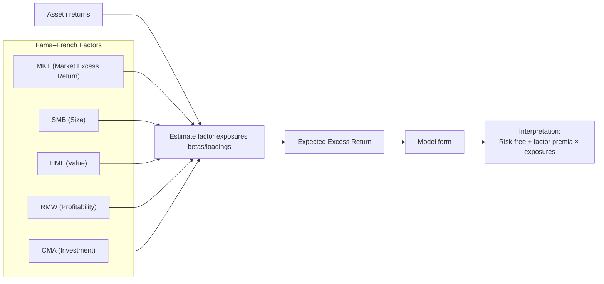

# Asset Price Modelling

At its core, asset price modelling tries to answer:

> **Why do assets earn the returns they do?**

* **Time value of money**: The principle that a dollar today is worth more than a dollar in the future due to the ability to earn a return and the presence of inflation.
* **Risk compensation**:   The additional return investors require for bearing uncertainty and the possibility of adverse outcomes.
* **Growth expectations**:   Market beliefs about future increases in cash flows, earnings, or economic activity that raise an asset’s expected value.
* **Behavioral / structural effects**:   Persistent pricing impacts caused by investor psychology, institutional constraints, regulation, or market frictions rather than fundamentals.

$$
\text{Expected Return} = \text{Risk-Free Rate} + \sum (\text{Risk Exposure} \times \text{Risk Premium})
$$

Where:
* **Expected Return**:   The average return investors anticipate earning on an asset over a given horizon.
* **Risk-Free Rate**:   The return on an investment with no default risk, representing pure time value of money (typically proxied by short-term government bonds). Data source:  [Treasury Rates](https://site.financialmodelingprep.com/developer/docs#treasury-rates)
* **Risk Exposure**:   The degree to which an asset’s returns co-move with a particular systematic risk factor (often measured by beta or factor loading).
* **Risk Premium**:   The excess return investors demand for holding one unit of a specific risk factor instead of the risk-free asset. Data source: [Market Risk Premium API](https://site.financialmodelingprep.com/developer/docs#market-risk-premium)

## CAPM – Capital Asset Pricing Model

The Capital Asset Pricing Model (CAPM) is a foundational asset pricing framework that explains an asset’s expected return as compensation for the time value of money and exposure to overall market risk. It assumes that only systematic (non-diversifiable) risk matters, which is captured by an asset’s sensitivity to market movements, known as beta.

$$
E[R_i] = R_f + \beta_i \left( E[R_m] - R_f \right)
$$

Where:

* **$E[R_i]$**:  The *expected return* of asset *i* over the investment horizon.

* **$R_f$**:  The *risk-free rate of return*, representing the time value of money with no exposure to default risk.  Data source:  [Treasury Rates](https://site.financialmodelingprep.com/developer/docs#treasury-rates)

* **$ \beta_i $**:  The *risk exposure" defined as the sensitivity (beta) of an asset *i*’s returns to movements in the overall market; a measure of systematic (non-diversifiable) risk.

* **$E[R_m]$**:  The *expected return* of the market portfolio, typically the historical average market return.

* **$E[R_m] - R_f$**: The *market risk premium* is the excess return investors require for holding the market portfolio instead of the risk-free asset, compensating for aggregate market risk. Data source: [Market Risk Premium API](https://site.financialmodelingprep.com/developer/docs#market-risk-premium)

> **Assets with higher exposure to market-wide risk must offer higher expected returns to attract investors.**

| Strengths                                       | Weaknesses                                          |
|-------------------------------------------------|-----------------------------------------------------|
| Simple and intuitive                            | Single-factor → empirically weak                    |
| Still used as a baseline (WACC, discount rates) | Assumes frictionless markets and rational investors |

👉 *Use it as a baseline, not a truth.*

The **Security Market Line** is a graph that shows the relationship between an asset’s **expected return** and its **systematic risk (beta)** under the CAPM.

**Problem:** CAPM gives you a formula, but it’s not obvious how to *interpret* it visually or diagnostically.
**Solution:** The **Security Market Line (SML)** turns CAPM into a simple picture that explains pricing, expected returns, and mispricing in one glance.

Where:
* **X-axis:** Beta ( ( \beta ) ) — exposure to market risk
* **Y-axis:** Expected return ( ( E[R] ) )
* **Intercept:** ( R_f ) (risk-free rate)
* **Slope:** ( E[R_m] - R_f ) (market risk premium)
* **Position on the line → fairly priced**.  Its expected return exactly compensates for its market risk and CAPM says it is correctly priced
* **Above the line → undervalued**. Higher return than CAPM requires for its beta, so the asset offers “too much” return for its risk
* **Below the line → overvalued**. Lower return than CAPM requires, so the asset does not sufficiently compensate for risk

Understanding of Beta vs return:
* **Beta = 0** → Expected return = risk-free rate
* **Beta = 1** → Expected return = market return
* **Higher beta** → higher required return (linear relationship)

Unlike the Capital Market Line (CML):
* SML applies to **any asset or portfolio**
* Risk is measured by **beta**, not volatility

Why the SML matters in practice:
| Valuation | Diagnostics | Limitations |
|-----------|-------------|-------------|
| Used to estimate **cost of equity** | Identifies assets that appear mispriced relative to market risk | Assumes CAPM holds (single-factor world) |
| Core input into WACC and DCF models | Helps explain why low-beta assets should earn less *in theory* | Breaks down when other risks are priced (size, value, momentum) |

## Fama–French Factor Models

The **Fama–French Factor Models** extend CAPM by explaining asset returns using multiple systematic risk factors beyond overall market exposure. These models show that characteristics such as company size, valuation, profitability, and investment behavior are persistently associated with differences in expected returns, forming the foundation of modern factor investing and empirical asset pricing.

| Model | Factors |
|-------|---------|
| **Three-Factor Model** | Market (MKT) Size (SMB – Small Minus Big) Value (HML – High Minus Low) |
| **Five-Factor Model** | Market (MKT) Size (SMB – Small Minus Big) Value (HML – High Minus Low) Profitability (RMW – Robust Minus Weak) Investment (CMA – Conservative Minus Aggressive) |

**Expected Excess Return:**
$$
E[R_i] - R_f 
$$

**Model Form:**
$$
E[R_i] = R_f + \beta_m MKT + \beta_s SMB + \beta_v HML + ...
$$

| Strengths                             | Weaknesses                                                                          |
|---------------------------------------|-------------------------------------------------------------------------------------|
| Much stronger empirical fit           | Factors are descriptive, not always causal                                          |
| Foundation of modern factor investing | Factor crowding risk, the risk that a widely used investment factor underperforms sharply because too much capital is allocated to the same positions, making the factor vulnerable to rapid, correlated unwinds.|

👉 *This is the workhorse for equity factor systems.*

### APT – Arbitrage Pricing Theory

**Idea:** Returns are driven by *any* priced risk factors, not a single market factor.

$$
E[R_i] = R_f + \sum \beta_{ik} \lambda_k
$$

* Factors can be macro, statistical, or latent
* No need to identify “the” market portfolio

| Strengths | Weaknesses |
|-||
| Flexible | Doesn’t tell you *which* factors to use |
| Conceptually clean |  |

👉 *APT is the philosophical foundation of custom factor models.*

## ICAPM – Intertemporal CAPM

**Idea:** Investors care about *future investment opportunities*, not just wealth.

Adds hedging demand for:

* Inflation risk
* Growth risk
* Volatility regimes

**Why it matters**

* Explains why macro variables show up in returns
* Bridges asset pricing and macroeconomics

👉 *Very relevant if you’re building macro-aware signals.*

# Consumption-based models (macro-first view)
Consumption-based models price assets based on how their returns co-move with aggregate consumption rather than market returns. Assets that perform poorly during economic downturns—when consumption falls—must offer higher expected returns as compensation for delivering low payoffs when investors value wealth the most.

## CCAPM – Consumption CAPM

Assets are priced by how they co-move with **consumption growth**.

$$
E[R_i] \propto \text{Cov}(R_i, \Delta C)
$$

**Interpretation**

* Assets that crash when consumption crashes must pay higher returns

**Reality**

* Elegant theory
* Weak empirical performance without extensions

👉 *Conceptually important, practically limited.*

# Modern empirical factor zoo

Beyond the classics, markets price many **persistent characteristics**:

* Value
* Momentum
* Quality
* Low volatility
* Profitability
* Investment
* Carry (rates, FX)
* Trend (time-series momentum)

These are usually modeled as:

* Cross-sectional regressions
* Portfolio sorts
* Long–short factor returns

👉 *Most “quant alpha” lives here.*

# Asset class–specific pricing logic
Asset class–specific pricing logic recognizes that different assets are driven by distinct cash flows, risk exposures, and macro sensitivities. As a result, each asset class requires its own pricing framework, even though all ultimately reflect compensation for time value of money, risk, and uncertainty.

## **Equities**

* Discounted cash flows + risk premia
* Growth expectations dominate short-term pricing
* Macro enters via discount rates

## **Bonds**

$$
\text{Yield} = \text{Expected Short Rates} + \text{Term Premium}
$$

**Key risks:**

* Inflation
* Duration
* Monetary policy

## **FX**

* Interest rate differentials (carry)
* Balance of payments
* Risk-on / risk-off regimes

## **Commodities**

* Supply/demand shocks
* Inventories
* Inflation hedging
* Convenience yield

# Regime awareness (often missing, very important)

Most pricing models assume **stationarity**. Reality doesn’t.

Common regimes:

* Inflation vs disinflation
* High vs low volatility
* Tight vs loose financial conditions

Practical fix:

* Conditional betas
* Regime-switching models
* Rolling factor loadings

👉 *Macro regimes explain why factors “stop working”.*

# Practical modelling takeaways 

If you’re building asset price models in code:

1. **Start simple**
   * CAPM → FF → Custom factors

2. **Separate**
   * Signal construction
   * Risk estimation
   * Portfolio construction

3. **Expect decay**
   * All factors weaken over time

4. **Watch correlations**
   * Diversification beats brilliance

5. **Model regimes explicitly**
   * Especially volatility and inflation

