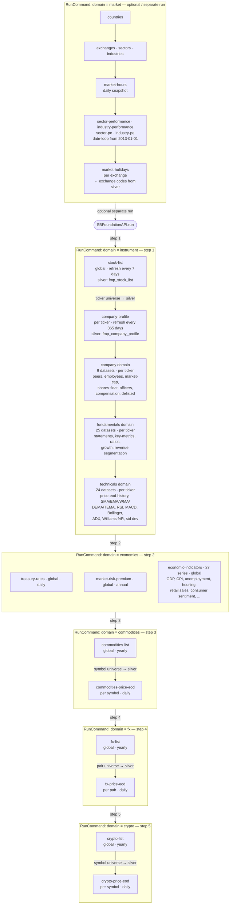

# SBFoundation Domain & Dataset Reference

**Last Updated**: 2026-02-18
**Source of Truth**: [`config/dataset_keymap.yaml`](../config/dataset_keymap.yaml)

This document is the single authoritative reference for all data domains and datasets ingested by SBFoundation. For each dataset you will find: purpose, scope, refresh cadence, Silver table name, key columns, and a link to the vendor API documentation.

---

## Table of Contents

1. [Domain Overview](#1-domain-overview)
2. [Dataset Loading Order](#2-dataset-loading-order)
3. [Instrument Domain](#3-instrument-domain)
4. [Company Domain](#4-company-domain)
5. [Fundamentals Domain](#5-fundamentals-domain)
6. [Technicals Domain](#6-technicals-domain)
7. [Economics Domain](#7-economics-domain)
8. [Market Domain](#8-market-domain)
9. [Commodities Domain](#9-commodities-domain)
10. [FX Domain](#10-fx-domain)
11. [Crypto Domain](#11-crypto-domain)
12. [Dataset Summary Table](#12-dataset-summary-table)

---

## 1. Domain Overview

SBFoundation ingests data across **9 domains** covering equities, macro economics, market structure, and alternative assets.

| Domain | Scope | Purpose | Datasets |
|---|---|---|---|
| **instrument** | global + per ticker | Ticker universe discovery; lists of equities, ETFs, indices, crypto, forex; ETF holdings | 6 |
| **company** | per ticker | Company metadata: profiles, peers, employees, compensation, corporate structure | 9 |
| **fundamentals** | per ticker | Financial statements, key metrics, ratios, growth rates, revenue segmentation | 25 |
| **technicals** | per ticker | Price history (OHLCV), moving averages, momentum, volatility indicators | 24 |
| **economics** | global | Macroeconomic time series: GDP, CPI, employment, treasury rates, mortgage rates | 29 |
| **market** | global + per exchange | Market structure: countries, exchanges, sectors, industries, hours, holidays, performance & PE | 10 |
| **commodities** | global + per symbol | Commodities universe and historical EOD prices | 2 |
| **fx** | global + per pair | Forex pair universe and historical EOD prices | 2 |
| **crypto** | global + per symbol | Cryptocurrency universe and historical EOD prices | 2 |

**Total: ~109 datasets** across 9 domains (economics has 27 discriminated series under one dataset name).

---

## 2. Dataset Loading Order

`SBFoundationAPI.run()` accepts a `domain` command. The canonical execution sequence is defined in `DOMAIN_EXECUTION_ORDER` in `src/sbfoundation/settings.py`. Company, fundamentals, and technicals have no standalone API entry point — they are executed internally within the `instrument` domain handler.

**Dependency rules:**
- `instrument` must run first — `stock-list` populates `silver.fmp_stock_list` which seeds the ticker universe for all per-ticker domains.
- `company-profile` runs before the rest of company/fundamentals/technicals within the same instrument run.
- In commodities, fx, and crypto: the **list dataset must load before price-eod** — price-eod queries silver for the symbol universe.
- In market: **exchanges must load before market-holidays** — holidays queries `silver.fmp_market_exchanges` for exchange codes.

---

## 3. Instrument Domain

**Purpose**: Discover and maintain the universe of tradeable instruments. Provides ticker lists for equities, ETFs, indices, cryptocurrencies, and forex pairs. ETF holdings enriches the universe with constituent relationships.

**Execution**: Step 1 of the main pipeline. Global list datasets run first (instrument discovery phase), then ETF holdings runs per-ticker (data acquisition phase).

**API Source**: Financial Modeling Prep (FMP)

### 3.1 stock-list

| Property | Value |
|---|---|
| **Purpose** | All available stock symbols; seeds the equity ticker universe |
| **Scope** | Global (single request) |
| **Silver Table** | `silver.fmp_stock_list` |
| **Key Columns** | `symbol` |
| **Refresh** | Every 7 days (Mon–Sat) |
| **FMP Plan** | basic |
| **API Docs** | [stock-list](https://site.financialmodelingprep.com/developer/docs#stock-list) |

### 3.2 etf-list

| Property | Value |
|---|---|
| **Purpose** | All available ETF symbols |
| **Scope** | Global (single request) |
| **Silver Table** | `silver.fmp_etf_list` |
| **Key Columns** | `symbol` |
| **Refresh** | Every 7 days (Mon–Sat) |
| **FMP Plan** | basic |
| **API Docs** | [etf-list](https://site.financialmodelingprep.com/developer/docs#etf-list) |

### 3.3 index-list

| Property | Value |
|---|---|
| **Purpose** | All available market index symbols from global exchanges |
| **Scope** | Global (single request) |
| **Silver Table** | `silver.fmp_index_list` |
| **Key Columns** | `symbol` |
| **Refresh** | Every 7 days (Mon–Sat) |
| **FMP Plan** | basic |
| **API Docs** | [index-list](https://site.financialmodelingprep.com/developer/docs#index-list) |

### 3.4 cryptocurrency-list

| Property | Value |
|---|---|
| **Purpose** | All cryptocurrencies traded on exchanges worldwide |
| **Scope** | Global (single request) |
| **Silver Table** | `silver.fmp_cryptocurrency_list` |
| **Key Columns** | `symbol` |
| **Refresh** | Every 7 days (Mon–Sat) |
| **FMP Plan** | basic |
| **API Docs** | [cryptocurrency-list](https://site.financialmodelingprep.com/developer/docs#cryptocurrency-list) |

### 3.5 forex-list

| Property | Value |
|---|---|
| **Purpose** | All forex currency pairs available for trading |
| **Scope** | Global (single request) |
| **Silver Table** | `silver.fmp_forex_list` |
| **Key Columns** | `symbol` |
| **Refresh** | Every 7 days (Mon–Sat) |
| **FMP Plan** | basic |
| **API Docs** | [forex-list](https://site.financialmodelingprep.com/developer/docs#forex-list) |

### 3.6 etf-holdings

| Property | Value |
|---|---|
| **Purpose** | Constituent holdings, weights, and market values for each ETF |
| **Scope** | Per ticker (every symbol in etf-list) |
| **Silver Table** | `silver.fmp_etf_holdings` |
| **Key Columns** | `ticker`, `asset`, `as_of_date` |
| **Refresh** | Every 7 days (Mon–Sat) |
| **FMP Plan** | basic |
| **API Docs** | [etf-holdings](https://site.financialmodelingprep.com/developer/docs#etf-holdings) |

---

## 4. Company Domain

**Purpose**: Per-ticker company metadata including business profiles, peer groups, workforce history, market capitalization, ownership structure, executive information, and compensation.

**Execution**: Runs within the `instrument` domain handler, after `company-profile` is loaded. All datasets except `company-delisted` are ticker-based.

**API Source**: Financial Modeling Prep (FMP)

### 4.1 company-profile

| Property | Value |
|---|---|
| **Purpose** | Business description, sector, industry, market cap, exchange, currency, beta, executives |
| **Scope** | Per ticker |
| **Silver Table** | `silver.fmp_company_profile` |
| **Key Columns** | `ticker` |
| **Refresh** | Every 365 days (Mon–Sat) |
| **FMP Plan** | basic |
| **API Docs** | [profile-symbol](https://site.financialmodelingprep.com/developer/docs#profile-symbol) |

> **Note**: Loaded before all other company/fundamentals/technicals datasets in the instrument pipeline. Tickers with prior `INVALID TICKER` errors are automatically filtered out.

### 4.2 company-notes

| Property | Value |
|---|---|
| **Purpose** | Additional company commentary and analyst notes |
| **Scope** | Per ticker |
| **Silver Table** | `silver.fmp_company_notes` |
| **Key Columns** | `ticker` |
| **Refresh** | Every 365 days (Sat) |
| **FMP Plan** | basic |
| **API Docs** | [company-notes](https://site.financialmodelingprep.com/developer/docs#company-notes) |

### 4.3 company-peers

| Property | Value |
|---|---|
| **Purpose** | List of peer/competitor companies for comparative analysis |
| **Scope** | Per ticker |
| **Silver Table** | `silver.fmp_company_peers` |
| **Key Columns** | `ticker` |
| **Refresh** | Every 365 days (Sat) |
| **FMP Plan** | basic |
| **API Docs** | [company-peers](https://site.financialmodelingprep.com/developer/docs#company-peers) |

### 4.4 company-employees

| Property | Value |
|---|---|
| **Purpose** | Historical employee count time series — signals growth or contraction |
| **Scope** | Per ticker |
| **Silver Table** | `silver.fmp_company_employees` |
| **Key Columns** | `ticker` |
| **Refresh** | Every 90 days (Mon–Sat) |
| **FMP Plan** | basic |
| **API Docs** | [historical-employee-count](https://site.financialmodelingprep.com/developer/docs#historical-employee-count) |

### 4.5 company-market-cap

| Property | Value |
|---|---|
| **Purpose** | Daily historical market capitalization; tracks valuation changes over time |
| **Scope** | Per ticker |
| **Silver Table** | `silver.fmp_company_market_cap` |
| **Key Columns** | `ticker` |
| **Refresh** | Every 1 day (Mon–Fri) |
| **FMP Plan** | basic |
| **API Docs** | [historical-market-capitalization](https://site.financialmodelingprep.com/developer/docs#historical-market-capitalization) |

### 4.6 company-shares-float

| Property | Value |
|---|---|
| **Purpose** | Historical shares float — tracks liquidity and ownership structure |
| **Scope** | Per ticker |
| **Silver Table** | `silver.fmp_company_shares_float` |
| **Key Columns** | `ticker` |
| **Refresh** | Every 90 days (Mon–Sat) |
| **FMP Plan** | basic |
| **API Docs** | [historical-shares-float](https://site.financialmodelingprep.com/developer/docs#historical-shares-float) |

### 4.7 company-officers

| Property | Value |
|---|---|
| **Purpose** | Executive team and key officers; tracks leadership changes |
| **Scope** | Per ticker |
| **Silver Table** | `silver.fmp_company_officers` |
| **Key Columns** | `ticker` |
| **Refresh** | Every 365 days (Sat) |
| **FMP Plan** | basic |
| **API Docs** | [company-officers](https://site.financialmodelingprep.com/developer/docs#company-officers) |

### 4.8 company-compensation

| Property | Value |
|---|---|
| **Purpose** | Executive compensation: salary, bonuses, stock awards, total pay |
| **Scope** | Per ticker |
| **Silver Table** | `silver.fmp_company_compensation` |
| **Key Columns** | `ticker` |
| **Refresh** | Every 365 days (Sat) |
| **FMP Plan** | basic |
| **API Docs** | [executive-compensation](https://site.financialmodelingprep.com/developer/docs#executive-compensation) |

### 4.9 company-delisted

| Property | Value |
|---|---|
| **Purpose** | Global list of companies removed from major exchanges |
| **Scope** | Global (single request) |
| **Silver Table** | `silver.fmp_company_delisted` |
| **Key Columns** | `symbol` |
| **Refresh** | Every 7 days (Sat) |
| **FMP Plan** | basic |
| **API Docs** | [delisted-companies](https://site.financialmodelingprep.com/developer/docs#delisted-companies) |

---

## 5. Fundamentals Domain

**Purpose**: Per-ticker financial statement data, valuation metrics, ratios, health scores, growth rates, and revenue segmentation. The primary source for quantitative fundamental analysis.

**Execution**: Runs within the `instrument` domain handler, after company domain. All datasets are per-ticker. Many datasets have three forms: base (no period), annual (`FY`), and quarterly (`quarter`) — each stored as a separate keymap entry with a discriminator.

**API Source**: Financial Modeling Prep (FMP)

### Financial Statements

| Dataset | Discriminator | Period | Silver Table | Refresh | API Docs |
|---|---|---|---|---|---|
| `income-statement` | `` (base) | most recent | `fmp_income_statement` | 90 days (Mon–Sat) | [link](https://site.financialmodelingprep.com/developer/docs#income-statement) |
| `income-statement` | `FY` | annual | `fmp_income_statement` | 90 days (Mon–Sat) | [link](https://site.financialmodelingprep.com/developer/docs#income-statement) |
| `income-statement` | `quarter` | quarterly | `fmp_income_statement` | 90 days (Mon–Sat) | [link](https://site.financialmodelingprep.com/developer/docs#income-statement) |
| `balance-sheet-statement` | `` (base) | most recent | `fmp_balance_sheet_statement` | 90 days (Mon–Sat) | [link](https://site.financialmodelingprep.com/developer/docs#balance-sheet-statement) |
| `balance-sheet-statement` | `FY` | annual | `fmp_balance_sheet_statement` | 90 days (Mon–Sat) | [link](https://site.financialmodelingprep.com/developer/docs#balance-sheet-statement) |
| `balance-sheet-statement` | `quarter` | quarterly | `fmp_balance_sheet_statement` | 90 days (Mon–Sat) | [link](https://site.financialmodelingprep.com/developer/docs#balance-sheet-statement) |
| `cashflow-statement` | `` (base) | most recent | `fmp_cashflow_statement` | 90 days (Mon–Sat) | [link](https://site.financialmodelingprep.com/developer/docs#cashflow-statement) |
| `cashflow-statement` | `FY` | annual | `fmp_cashflow_statement` | 90 days (Mon–Sat) | [link](https://site.financialmodelingprep.com/developer/docs#cashflow-statement) |
| `cashflow-statement` | `quarter` | quarterly | `fmp_cashflow_statement` | 90 days (Mon–Sat) | [link](https://site.financialmodelingprep.com/developer/docs#cashflow-statement) |
| `latest-financial-statements` | — | most recent | `fmp_latest_financial_statements` | 1 day (Mon–Fri) | [link](https://site.financialmodelingprep.com/developer/docs#latest-financial-statements) |

**Income Statement** covers: revenue, cost of revenue, gross profit, operating income, EBITDA, net income, EPS (basic + diluted).

**Balance Sheet** covers: total assets, total liabilities, equity, cash, total debt, working capital.

**Cash Flow** covers: operating, investing, and financing activities; free cash flow; capital expenditure.

**Latest Financial Statements** returns the most recently filed income statement, balance sheet, and cash flow in a single call — useful for real-time screening.

### Key Metrics & Ratios

| Dataset | Discriminator | Purpose | Silver Table | Refresh | API Docs |
|---|---|---|---|---|---|
| `key-metrics` | `` (base) | Core metrics — no period filter | `fmp_key_metrics` | 90 days | [link](https://site.financialmodelingprep.com/developer/docs#key-metrics) |
| `key-metrics` | `FY` | Annual key metrics (P/E, P/B, ROE, ROA, EV/EBITDA) | `fmp_key_metrics` | 90 days | [link](https://site.financialmodelingprep.com/developer/docs#key-metrics) |
| `key-metrics` | `quarter` | Quarterly key metrics | `fmp_key_metrics` | 90 days | [link](https://site.financialmodelingprep.com/developer/docs#key-metrics) |
| `metric-ratios` | `` (base) | Financial ratios — no period filter | `fmp_metric_ratios` | 90 days | [link](https://site.financialmodelingprep.com/developer/docs#financial-ratios) |
| `metric-ratios` | `FY` | Annual ratios (liquidity, solvency, profitability, efficiency) | `fmp_metric_ratios` | 90 days | [link](https://site.financialmodelingprep.com/developer/docs#financial-ratios) |
| `metric-ratios` | `quarter` | Quarterly financial ratios | `fmp_metric_ratios` | 90 days | [link](https://site.financialmodelingprep.com/developer/docs#financial-ratios) |
| `key-metrics-ttm` | — | Trailing twelve months key metrics | `fmp_key_metrics_ttm` | 1 day (Mon–Fri) | [link](https://site.financialmodelingprep.com/developer/docs#key-metrics-ttm) |
| `ratios-ttm` | — | Trailing twelve months financial ratios | `fmp_ratios_ttm` | 1 day (Mon–Fri) | [link](https://site.financialmodelingprep.com/developer/docs#financial-ratios-ttm) |
| `financial-scores` | — | Altman Z-Score, Piotroski F-Score, composite health scores | `fmp_financial_scores` | 90 days | [link](https://site.financialmodelingprep.com/developer/docs#financial-scores) |
| `owner-earnings` | — | Buffett's owner earnings profitability metric | `fmp_owner_earnings` | 90 days | [link](https://site.financialmodelingprep.com/developer/docs#owner-earnings) |
| `enterprise-values` | — | Enterprise value, EV/EBITDA, EV/Revenue | `fmp_enterprise_values` | 90 days | [link](https://site.financialmodelingprep.com/developer/docs#enterprise-values) |

### Growth Metrics

| Dataset | Discriminator | Purpose | Silver Table | Refresh | API Docs |
|---|---|---|---|---|---|
| `income-statement-growth` | `` (base) | Revenue/income growth — no period filter | `fmp_income_statement_growth` | 90 days | [link](https://site.financialmodelingprep.com/developer/docs#income-statement-growth) |
| `income-statement-growth` | `FY` | Year-over-year income statement growth rates | `fmp_income_statement_growth` | 90 days | [link](https://site.financialmodelingprep.com/developer/docs#income-statement-growth) |
| `income-statement-growth` | `quarter` | Quarter-over-quarter income statement growth rates | `fmp_income_statement_growth` | 90 days | [link](https://site.financialmodelingprep.com/developer/docs#income-statement-growth) |
| `balance-sheet-statement-growth` | `` (base) | Balance sheet growth — no period filter | `fmp_balance_sheet_statement_growth` | 90 days | [link](https://site.financialmodelingprep.com/developer/docs#balance-sheet-statement-growth) |
| `balance-sheet-statement-growth` | `FY` | Year-over-year balance sheet growth rates | `fmp_balance_sheet_statement_growth` | 90 days | [link](https://site.financialmodelingprep.com/developer/docs#balance-sheet-statement-growth) |
| `balance-sheet-statement-growth` | `quarter` | Quarter-over-quarter balance sheet growth rates | `fmp_balance_sheet_statement_growth` | 90 days | [link](https://site.financialmodelingprep.com/developer/docs#balance-sheet-statement-growth) |
| `cashflow-statement-growth` | `` (base) | Cash flow growth — no period filter | `fmp_cashflow_statement_growth` | 90 days | [link](https://site.financialmodelingprep.com/developer/docs#cashflow-statement-growth) |
| `cashflow-statement-growth` | `FY` | Year-over-year cash flow growth rates | `fmp_cashflow_statement_growth` | 90 days | [link](https://site.financialmodelingprep.com/developer/docs#cashflow-statement-growth) |
| `cashflow-statement-growth` | `quarter` | Quarter-over-quarter cash flow growth rates | `fmp_cashflow_statement_growth` | 90 days | [link](https://site.financialmodelingprep.com/developer/docs#cashflow-statement-growth) |
| `financial-statement-growth` | — | Comprehensive growth metrics across all three statements | `fmp_financial_statement_growth` | 90 days | [link](https://site.financialmodelingprep.com/developer/docs#financial-statement-growth) |

### Revenue Segmentation

| Dataset | Purpose | Silver Table | Refresh | FMP Plan | API Docs |
|---|---|---|---|---|---|
| `revenue-product-segmentation` | Revenue breakdown by product line or business segment | `fmp_revenue_product_segmentation` | 90 days (Mon–Sat) | starter+ | [link](https://site.financialmodelingprep.com/developer/docs#revenue-product-segmentation) |
| `revenue-geographic-segmentation` | Revenue breakdown by geographic region | `fmp_revenue_geographic_segmentation` | 90 days (Mon–Sat) | starter+ | [link](https://site.financialmodelingprep.com/developer/docs#revenue-geographic-segmentation) |

> **Note**: Revenue segmentation datasets require **starter plan or higher** (not available on the basic free plan).

---

## 6. Technicals Domain

**Purpose**: Per-ticker price history and technical indicators for quantitative and technical analysis. Covers three price series variants (split-adjusted, non-split-adjusted, dividend-adjusted) and a comprehensive set of moving averages, momentum, and volatility indicators.

**Execution**: Runs within the `instrument` domain handler, after fundamentals. All datasets are per-ticker and refresh daily on weekdays.

**API Source**: Financial Modeling Prep (FMP) — all indicators via `stable/technical_indicator/daily`

### Historical Price Data

| Dataset | Purpose | Silver Table | Refresh |
|---|---|---|---|
| `technicals-historical-price-eod-full` | OHLCV + split-adjusted prices; standard total return series | `fmp_technicals_historical_price_eod_full` | 1 day (Mon–Fri) |
| `technicals-historical-price-eod-non-split-adjusted` | Raw unadjusted prices for strategies requiring pre-split data | `fmp_technicals_historical_price_eod_non_split_adjusted` | 1 day (Mon–Fri) |
| `technicals-historical-price-eod-dividend-adjusted` | Dividend-adjusted prices for total return analysis | `fmp_technicals_historical_price_eod_dividend_adjusted` | 1 day (Mon–Fri) |

All three price series include: `open`, `high`, `low`, `close`, `volume`, `change`, `change_percent`.

**API Docs**: [historical-price-eod-full](https://site.financialmodelingprep.com/developer/docs#historical-price-eod-full)

### Moving Averages

All moving average datasets share the same Silver table structure: `date`, `open`, `high`, `low`, `close`, `volume`, `indicator_value`.

| Dataset | Period | Type | Purpose | Silver Table |
|---|---|---|---|---|
| `technicals-sma-20` | 20 | SMA | Short-term trend | `fmp_technicals_sma` |
| `technicals-sma-50` | 50 | SMA | Medium-term trend | `fmp_technicals_sma` |
| `technicals-sma-200` | 200 | SMA | Long-term trend; bull/bear market line | `fmp_technicals_sma` |
| `technicals-ema-12` | 12 | EMA | Fast EMA; MACD signal input | `fmp_technicals_ema` |
| `technicals-ema-26` | 26 | EMA | Slow EMA; MACD signal input | `fmp_technicals_ema` |
| `technicals-ema-50` | 50 | EMA | Medium-term exponential trend | `fmp_technicals_ema` |
| `technicals-ema-200` | 200 | EMA | Long-term exponential trend | `fmp_technicals_ema` |
| `technicals-wma-20` | 20 | WMA | Weighted short-term average | `fmp_technicals_wma` |
| `technicals-wma-50` | 50 | WMA | Weighted medium-term average | `fmp_technicals_wma` |
| `technicals-wma-200` | 200 | WMA | Weighted long-term average | `fmp_technicals_wma` |
| `technicals-dema-12` | 12 | DEMA | Double EMA — reduced lag vs EMA | `fmp_technicals_dema` |
| `technicals-dema-26` | 26 | DEMA | Double EMA — reduced lag vs EMA | `fmp_technicals_dema` |
| `technicals-dema-50` | 50 | DEMA | Double EMA — reduced lag vs EMA | `fmp_technicals_dema` |
| `technicals-dema-200` | 200 | DEMA | Double EMA — reduced lag vs EMA | `fmp_technicals_dema` |
| `technicals-tema-20` | 20 | TEMA | Triple EMA — further reduced lag | `fmp_technicals_tema` |

All moving averages refresh every 1 day (Mon–Fri), FMP basic plan.

**API Docs**: [technical-indicators](https://site.financialmodelingprep.com/developer/docs#technical-indicators)

### Momentum & Volatility Indicators

| Dataset | Period | Indicator | Purpose | Silver Table | Refresh |
|---|---|---|---|---|---|
| `technicals-rsi-14` | 14 | RSI | Standard overbought/oversold momentum | `fmp_technicals_rsi` | 1 day (Mon–Fri) |
| `technicals-rsi-7` | 7 | RSI | Sensitive short-term momentum | `fmp_technicals_rsi` | 1 day (Mon–Fri) |
| `technicals-williams-14` | 14 | Williams %R | Momentum oscillator (−100 to 0) | `fmp_technicals_williams` | 1 day (Mon–Fri) |
| `technicals-adx-14` | 14 | ADX | Trend strength (directionless; >25 = strong) | `fmp_technicals_adx` | 1 day (Mon–Fri) |
| `technicals-standard-deviation-20` | 20 | Std Dev | Historical volatility; Bollinger Band width input | `fmp_technicals_standard_deviation` | 1 day (Mon–Fri) |

All momentum/volatility datasets use FMP basic plan.

---

## 7. Economics Domain

**Purpose**: Global macroeconomic time series for top-down analysis, macro-regime identification, and risk-free rate modeling. All datasets are globally scoped (no ticker dependency) and run independently of the instrument pipeline.

**Execution**: Step 2 of the main pipeline. Can run concurrently with the instrument domain since there are no data dependencies between them.

**API Source**: Financial Modeling Prep (FMP)

### 7.1 treasury-rates

| Property | Value |
|---|---|
| **Purpose** | Daily U.S. Treasury yield curve from 1-month to 30-year maturities; risk-free rate for CAPM and option pricing |
| **Scope** | Global (single request) |
| **Silver Table** | `silver.fmp_treasury_rates` |
| **Key Columns** | `date` |
| **Refresh** | Every 1 day (Mon–Fri) |
| **FMP Plan** | basic |
| **API Docs** | [treasury-rates](https://site.financialmodelingprep.com/developer/docs#treasury-rates) |

### 7.2 market-risk-premium

| Property | Value |
|---|---|
| **Purpose** | Annual market risk premium by country for CAPM equity risk modeling |
| **Scope** | Global (single request) |
| **Silver Table** | `silver.fmp_market_risk_premium` |
| **Key Columns** | `country` |
| **Refresh** | Every 365 days (Sat) |
| **FMP Plan** | basic |
| **API Docs** | [market-risk-premium](https://site.financialmodelingprep.com/developer/docs#market-risk-premium) |

### 7.3 economic-indicators (27 series)

All 27 series share the dataset name `economic-indicators` with a unique discriminator per series. Silver table: `silver.fmp_economic_indicators`.

| Discriminator | Indicator | Purpose | Refresh | Run Days |
|---|---|---|---|---|
| `GDP` | U.S. GDP | Total economic output; business cycle tracking | 30 days | Mon–Sat |
| `realGDP` | Real GDP | Inflation-adjusted output | 30 days | Mon–Sat |
| `nominalPotentialGDP` | Nominal Potential GDP | Output gap analysis | 30 days | Mon–Sat |
| `realGDPPerCapita` | Real GDP Per Capita | Per-person productivity | 30 days | Mon–Sat |
| `federalFunds` | Federal Funds Rate | Fed monetary policy target rate | 1 day | Mon–Fri |
| `CPI` | Consumer Price Index | Inflation tracking; real return calculations | 30 days | Mon–Sat |
| `inflationRate` | Inflation Rate | YoY CPI percentage change | 30 days | Mon–Sat |
| `inflation` | Inflation | Alternative inflation measure | 30 days | Mon–Sat |
| `retailSales` | Retail Sales | Consumer spending health | 30 days | Mon–Sat |
| `consumerSentiment` | Consumer Sentiment Index | Consumer confidence | 30 days | Mon–Sat |
| `durableGoodsOrders` | Durable Goods Orders | Manufacturing and business investment | 30 days | Mon–Sat |
| `durableGoods` | Durable Goods | Capital goods demand | 30 days | Mon–Sat |
| `unemploymentRate` | Unemployment Rate | Labor market health | 30 days | Mon–Sat |
| `totalNonfarmPayroll` | Total Nonfarm Payroll | Employment growth (jobs report) | 30 days | Mon–Sat |
| `initialClaims` | Initial Jobless Claims | Weekly labor market leading indicator | 7 days | Mon–Fri |
| `industrialProductionTotalIndex` | Industrial Production Index | Manufacturing output | 30 days | Mon–Sat |
| `newPrivatelyOwnedHousingUnitsStartedTotalUnits` | Housing Starts | Residential construction activity | 30 days | Mon–Sat |
| `totalVehicleSales` | Total Vehicle Sales | Consumer spending; auto industry | 30 days | Mon–Sat |
| `retailMoneyFunds` | Retail Money Funds | Money market fund assets | 30 days | Mon–Sat |
| `smoothedUSRecessionProbabilities` | Recession Probabilities | Economic cycle and downturn risk | 30 days | Mon–Sat |
| `tradeBalanceGoodsAndServices` | Trade Balance | International trade surplus/deficit | 30 days | Mon–Sat |
| `15YearFixedRateMortgageAverage` | 15-Year Mortgage Average | Housing market; interest rate tracking | 7 days | Mon–Sat |
| `30YearFixedRateMortgageAverage` | 30-Year Mortgage Average | Housing market; long-term rate tracking | 7 days | Mon–Sat |
| `3MonthOr90DayRatesAndYieldsCertificatesOfDeposit` | 3-Month CD Rates | Short-term savings rate | 7 days | Mon–Sat |
| `commercialBankInterestRateOnCreditCardPlansAllAccounts` | Credit Card Interest Rate | Consumer credit cost | 30 days | Mon–Sat |
| `industrialProductionTotalIndex` | Industrial Production Index | Manufacturing output | 30 days | Mon–Sat |

All economic indicator series use FMP basic plan. Key columns: `date`, `discriminator`.

**API Docs**: [economic-indicators](https://site.financialmodelingprep.com/developer/docs#economic-indicators)

---

## 8. Market Domain

**Purpose**: Market structure reference data for exchanges, sectors, industries, and countries. Provides daily performance snapshots and PE ratio time series from 2013 onward, and historical market holidays per exchange.

**Execution**: Optional separate run — market data does not feed into the main instrument pipeline and is typically run independently (e.g., weekly or on demand). Internal execution phases are sequential due to silver dependencies.

**API Source**: Financial Modeling Prep (FMP)

### Phase 1a — Baseline (runs first)

#### 8.1 market-countries

| Property | Value |
|---|---|
| **Purpose** | All countries where stock symbols are available; used as a reference dimension |
| **Scope** | Global |
| **Silver Table** | `silver.fmp_market_countries` |
| **Key Columns** | `country` |
| **Refresh** | Every 365 days (Mon–Sat) |
| **FMP Plan** | basic |
| **API Docs** | [available-countries](https://site.financialmodelingprep.com/developer/docs#available-countries) |

### Phase 1b — Reference Dimensions (run after countries)

#### 8.2 market-exchanges

| Property | Value |
|---|---|
| **Purpose** | All supported global stock exchanges; feeds market-holidays (exchange codes from silver) |
| **Scope** | Global |
| **Silver Table** | `silver.fmp_market_exchanges` |
| **Key Columns** | `exchange` |
| **Refresh** | Every 365 days (Mon–Sat) |
| **FMP Plan** | basic |
| **API Docs** | [available-exchanges](https://site.financialmodelingprep.com/developer/docs#available-exchanges) |

#### 8.3 market-sectors

| Property | Value |
|---|---|
| **Purpose** | All industry sectors; reference for sector-performance and sector-PE |
| **Scope** | Global |
| **Silver Table** | `silver.fmp_market_sectors` |
| **Key Columns** | `sector` |
| **Refresh** | Every 365 days (Mon–Sat) |
| **FMP Plan** | basic |
| **API Docs** | [available-sectors](https://site.financialmodelingprep.com/developer/docs#available-sectors) |

#### 8.4 market-industries

| Property | Value |
|---|---|
| **Purpose** | All industries; reference for industry-performance and industry-PE |
| **Scope** | Global |
| **Silver Table** | `silver.fmp_market_industries` |
| **Key Columns** | `industry` |
| **Refresh** | Every 365 days (Mon–Sat) |
| **FMP Plan** | basic |
| **API Docs** | [available-industries](https://site.financialmodelingprep.com/developer/docs#available-industries) |

### Phase 2a — Daily Snapshots

#### 8.5 market-hours

| Property | Value |
|---|---|
| **Purpose** | Daily snapshot of trading hours across all exchanges; shows which markets are currently open |
| **Scope** | Global |
| **Silver Table** | `silver.fmp_market_hours` |
| **Key Columns** | `exchange`, `as_of_date` |
| **Refresh** | Every 1 day (Mon–Fri) |
| **FMP Plan** | basic |
| **API Docs** | [all-exchange-market-hours](https://site.financialmodelingprep.com/developer/docs#all-exchange-market-hours) |

### Phase 2b — Date-Loop Datasets (back-filled from 2013-01-01)

All four datasets below are fetched for **every market weekday from 2013-01-01** through today. The date is used as the discriminator in the keymap, enabling idempotent re-ingestion.

#### 8.6 market-sector-performance

| Property | Value |
|---|---|
| **Purpose** | Daily average price change (%) across all sectors — for top-down sector rotation analysis |
| **Scope** | Global (by snapshot date) |
| **Silver Table** | `silver.fmp_market_sector_performance` |
| **Key Columns** | `sector`, `date` |
| **Refresh** | Every 1 day (Mon–Fri) |
| **FMP Plan** | basic |
| **API Docs** | [sector-performance-snapshot](https://site.financialmodelingprep.com/developer/docs#sector-performance-snapshot) |

#### 8.7 market-industry-performance

| Property | Value |
|---|---|
| **Purpose** | Daily average price change (%) across all industries |
| **Scope** | Global (by snapshot date) |
| **Silver Table** | `silver.fmp_market_industry_performance` |
| **Key Columns** | `industry`, `date` |
| **Refresh** | Every 1 day (Mon–Fri) |
| **FMP Plan** | basic |
| **API Docs** | [industry-performance-snapshot](https://site.financialmodelingprep.com/developer/docs#industry-performance-snapshot) |

#### 8.8 market-sector-pe

| Property | Value |
|---|---|
| **Purpose** | Daily P/E ratios by sector — for cross-sector valuation comparison |
| **Scope** | Global (by snapshot date) |
| **Silver Table** | `silver.fmp_market_sector_pe` |
| **Key Columns** | `sector`, `date` |
| **Refresh** | Every 1 day (Mon–Fri) |
| **FMP Plan** | basic |
| **API Docs** | [sector-pe-snapshot](https://site.financialmodelingprep.com/developer/docs#industry-performance-snapshot) |

#### 8.9 market-industry-pe

| Property | Value |
|---|---|
| **Purpose** | Daily P/E ratios by industry — for granular valuation analysis |
| **Scope** | Global (by snapshot date) |
| **Silver Table** | `silver.fmp_market_industry_pe` |
| **Key Columns** | `industry`, `date` |
| **Refresh** | Every 1 day (Mon–Fri) |
| **FMP Plan** | basic |
| **API Docs** | [industry-pe-snapshot](https://site.financialmodelingprep.com/developer/docs#industry-pe-snapshot) |

### Phase 2c — Per-Exchange (requires exchanges in silver)

#### 8.10 market-holidays

| Property | Value |
|---|---|
| **Purpose** | Market holidays for each exchange; exchange codes sourced from `silver.fmp_market_exchanges` |
| **Scope** | Per exchange code |
| **Silver Table** | `silver.fmp_market_holidays` |
| **Key Columns** | `exchange`, `date` |
| **Refresh** | Every 365 days (Mon–Sat) |
| **FMP Plan** | basic |
| **API Docs** | [holidays-by-exchange](https://site.financialmodelingprep.com/developer/docs#holidays-by-exchange) |

---

## 9. Commodities Domain

**Purpose**: Universe of tradeable commodities (energy, metals, agricultural) and historical end-of-day prices. The list is loaded first, then prices are fetched per symbol using the list as the universe.

**Execution**: Step 3 of the main pipeline. `commodities-list` must be loaded before `commodities-price-eod`.

**API Source**: Financial Modeling Prep (FMP)

### 9.1 commodities-list

| Property | Value |
|---|---|
| **Purpose** | All tracked commodities across energy, metals, and agricultural sectors |
| **Scope** | Global (single request) |
| **Silver Table** | `silver.fmp_commodities_list` |
| **Key Columns** | `symbol` |
| **Refresh** | Every 365 days (Mon–Sat) |
| **FMP Plan** | basic |
| **API Docs** | [commodities-list](https://site.financialmodelingprep.com/developer/docs#Commoditiescurrency-list) |

### 9.2 commodities-price-eod

| Property | Value |
|---|---|
| **Purpose** | Full historical OHLCV end-of-day prices per commodity symbol |
| **Scope** | Per symbol (universe from `silver.fmp_commodities_list`) |
| **Silver Table** | `silver.fmp_commodities_price_eod` |
| **Key Columns** | `symbol`, `date` |
| **Refresh** | Every 1 day (Mon–Fri) |
| **FMP Plan** | basic |
| **API Docs** | [historical-price-eod-full](https://site.financialmodelingprep.com/developer/docs#Commoditiescurrency-historical-price-eod-full) |

---

## 10. FX Domain

**Purpose**: Universe of forex currency pairs and historical end-of-day exchange rates. Parallel structure to commodities — list loads first, then prices per pair.

**Execution**: Step 4 of the main pipeline. `fx-list` must be loaded before `fx-price-eod`.

**API Source**: Financial Modeling Prep (FMP)

### 10.1 fx-list

| Property | Value |
|---|---|
| **Purpose** | All forex currency pairs available for trading (e.g., EURUSD, GBPJPY) |
| **Scope** | Global (single request) |
| **Silver Table** | `silver.fmp_fx_list` |
| **Key Columns** | `symbol` |
| **Refresh** | Every 365 days (Mon–Sat) |
| **FMP Plan** | basic |
| **API Docs** | [forex-list](https://site.financialmodelingprep.com/developer/docs#forex-list) |

### 10.2 fx-price-eod

| Property | Value |
|---|---|
| **Purpose** | Full historical OHLCV end-of-day prices per forex pair |
| **Scope** | Per pair (universe from `silver.fmp_fx_list`) |
| **Silver Table** | `silver.fmp_fx_price_eod` |
| **Key Columns** | `symbol`, `date` |
| **Refresh** | Every 1 day (Mon–Fri) |
| **FMP Plan** | basic |
| **API Docs** | [forex-historical-price-eod-full](https://site.financialmodelingprep.com/developer/docs#forex-historical-price-eod-full) |

---

## 11. Crypto Domain

**Purpose**: Universe of cryptocurrencies and historical end-of-day prices. Parallel structure to commodities and FX — list loads first, then prices per symbol.

**Execution**: Step 5 of the main pipeline. `crypto-list` must be loaded before `crypto-price-eod`.

**API Source**: Financial Modeling Prep (FMP)

### 11.1 crypto-list

| Property | Value |
|---|---|
| **Purpose** | All cryptocurrencies traded on exchanges worldwide (e.g., BTCUSD, ETHUSD) |
| **Scope** | Global (single request) |
| **Silver Table** | `silver.fmp_crypto_list` |
| **Key Columns** | `symbol` |
| **Refresh** | Every 365 days (Mon–Sat) |
| **FMP Plan** | basic |
| **API Docs** | [cryptocurrency-list](https://site.financialmodelingprep.com/developer/docs#cryptocurrency-list) |

### 11.2 crypto-price-eod

| Property | Value |
|---|---|
| **Purpose** | Full historical OHLCV end-of-day prices per cryptocurrency symbol |
| **Scope** | Per symbol (universe from `silver.fmp_crypto_list`) |
| **Silver Table** | `silver.fmp_crypto_price_eod` |
| **Key Columns** | `symbol`, `date` |
| **Refresh** | Every 1 day (Mon–Fri) |
| **FMP Plan** | basic |
| **API Docs** | [cryptocurrency-historical-price-eod-full](https://site.financialmodelingprep.com/developer/docs#cryptocurrency-historical-price-eod-full) |

---

## 12. Dataset Summary Table

| Domain | Dataset | Discriminator | Scope | Refresh (days) | Run Days | FMP Plan | Silver Table |
|---|---|---|---|---|---|---|---|
| instrument | stock-list | — | global | 7 | Mon–Sat | basic | fmp_stock_list |
| instrument | etf-list | — | global | 7 | Mon–Sat | basic | fmp_etf_list |
| instrument | index-list | — | global | 7 | Mon–Sat | basic | fmp_index_list |
| instrument | cryptocurrency-list | — | global | 7 | Mon–Sat | basic | fmp_cryptocurrency_list |
| instrument | forex-list | — | global | 7 | Mon–Sat | basic | fmp_forex_list |
| instrument | etf-holdings | — | per ticker | 7 | Mon–Sat | basic | fmp_etf_holdings |
| company | company-profile | — | per ticker | 365 | Mon–Sat | basic | fmp_company_profile |
| company | company-notes | — | per ticker | 365 | Sat | basic | fmp_company_notes |
| company | company-peers | — | per ticker | 365 | Sat | basic | fmp_company_peers |
| company | company-employees | — | per ticker | 90 | Mon–Sat | basic | fmp_company_employees |
| company | company-market-cap | — | per ticker | 1 | Mon–Fri | basic | fmp_company_market_cap |
| company | company-shares-float | — | per ticker | 90 | Mon–Sat | basic | fmp_company_shares_float |
| company | company-officers | — | per ticker | 365 | Sat | basic | fmp_company_officers |
| company | company-compensation | — | per ticker | 365 | Sat | basic | fmp_company_compensation |
| company | company-delisted | — | global | 7 | Sat | basic | fmp_company_delisted |
| fundamentals | income-statement | base/FY/quarter | per ticker | 90 | Mon–Sat | basic | fmp_income_statement |
| fundamentals | balance-sheet-statement | base/FY/quarter | per ticker | 90 | Mon–Sat | basic | fmp_balance_sheet_statement |
| fundamentals | cashflow-statement | base/FY/quarter | per ticker | 90 | Mon–Sat | basic | fmp_cashflow_statement |
| fundamentals | latest-financial-statements | — | per ticker | 1 | Mon–Fri | basic | fmp_latest_financial_statements |
| fundamentals | key-metrics | base/FY/quarter | per ticker | 90 | Mon–Sat | basic | fmp_key_metrics |
| fundamentals | metric-ratios | base/FY/quarter | per ticker | 90 | Mon–Sat | basic | fmp_metric_ratios |
| fundamentals | key-metrics-ttm | — | per ticker | 1 | Mon–Fri | basic | fmp_key_metrics_ttm |
| fundamentals | ratios-ttm | — | per ticker | 1 | Mon–Fri | basic | fmp_ratios_ttm |
| fundamentals | financial-scores | — | per ticker | 90 | Mon–Sat | basic | fmp_financial_scores |
| fundamentals | owner-earnings | — | per ticker | 90 | Mon–Sat | basic | fmp_owner_earnings |
| fundamentals | enterprise-values | — | per ticker | 90 | Mon–Sat | basic | fmp_enterprise_values |
| fundamentals | income-statement-growth | base/FY/quarter | per ticker | 90 | Mon–Sat | basic | fmp_income_statement_growth |
| fundamentals | balance-sheet-statement-growth | base/FY/quarter | per ticker | 90 | Mon–Sat | basic | fmp_balance_sheet_statement_growth |
| fundamentals | cashflow-statement-growth | base/FY/quarter | per ticker | 90 | Mon–Sat | basic | fmp_cashflow_statement_growth |
| fundamentals | financial-statement-growth | — | per ticker | 90 | Mon–Sat | basic | fmp_financial_statement_growth |
| fundamentals | revenue-product-segmentation | — | per ticker | 90 | Mon–Sat | **starter+** | fmp_revenue_product_segmentation |
| fundamentals | revenue-geographic-segmentation | — | per ticker | 90 | Mon–Sat | **starter+** | fmp_revenue_geographic_segmentation |
| technicals | technicals-historical-price-eod-full | — | per ticker | 1 | Mon–Fri | basic | fmp_technicals_historical_price_eod_full |
| technicals | technicals-historical-price-eod-non-split-adjusted | — | per ticker | 1 | Mon–Fri | basic | fmp_technicals_historical_price_eod_non_split_adjusted |
| technicals | technicals-historical-price-eod-dividend-adjusted | — | per ticker | 1 | Mon–Fri | basic | fmp_technicals_historical_price_eod_dividend_adjusted |
| technicals | technicals-sma-20 | 20 | per ticker | 1 | Mon–Fri | basic | fmp_technicals_sma |
| technicals | technicals-sma-50 | 50 | per ticker | 1 | Mon–Fri | basic | fmp_technicals_sma |
| technicals | technicals-sma-200 | 200 | per ticker | 1 | Mon–Fri | basic | fmp_technicals_sma |
| technicals | technicals-ema-12 | 12 | per ticker | 1 | Mon–Fri | basic | fmp_technicals_ema |
| technicals | technicals-ema-26 | 26 | per ticker | 1 | Mon–Fri | basic | fmp_technicals_ema |
| technicals | technicals-ema-50 | 50 | per ticker | 1 | Mon–Fri | basic | fmp_technicals_ema |
| technicals | technicals-ema-200 | 200 | per ticker | 1 | Mon–Fri | basic | fmp_technicals_ema |
| technicals | technicals-wma-20 | 20 | per ticker | 1 | Mon–Fri | basic | fmp_technicals_wma |
| technicals | technicals-wma-50 | 50 | per ticker | 1 | Mon–Fri | basic | fmp_technicals_wma |
| technicals | technicals-wma-200 | 200 | per ticker | 1 | Mon–Fri | basic | fmp_technicals_wma |
| technicals | technicals-dema-12 | 12 | per ticker | 1 | Mon–Fri | basic | fmp_technicals_dema |
| technicals | technicals-dema-26 | 26 | per ticker | 1 | Mon–Fri | basic | fmp_technicals_dema |
| technicals | technicals-dema-50 | 50 | per ticker | 1 | Mon–Fri | basic | fmp_technicals_dema |
| technicals | technicals-dema-200 | 200 | per ticker | 1 | Mon–Fri | basic | fmp_technicals_dema |
| technicals | technicals-tema-20 | 20 | per ticker | 1 | Mon–Fri | basic | fmp_technicals_tema |
| technicals | technicals-rsi-14 | 14 | per ticker | 1 | Mon–Fri | basic | fmp_technicals_rsi |
| technicals | technicals-rsi-7 | 7 | per ticker | 1 | Mon–Fri | basic | fmp_technicals_rsi |
| technicals | technicals-williams-14 | 14 | per ticker | 1 | Mon–Fri | basic | fmp_technicals_williams |
| technicals | technicals-adx-14 | 14 | per ticker | 1 | Mon–Fri | basic | fmp_technicals_adx |
| technicals | technicals-standard-deviation-20 | 20 | per ticker | 1 | Mon–Fri | basic | fmp_technicals_standard_deviation |
| economics | treasury-rates | — | global | 1 | Mon–Fri | basic | fmp_treasury_rates |
| economics | market-risk-premium | — | global | 365 | Sat | basic | fmp_market_risk_premium |
| economics | economic-indicators | GDP | global | 30 | Mon–Sat | basic | fmp_economic_indicators |
| economics | economic-indicators | realGDP | global | 30 | Mon–Sat | basic | fmp_economic_indicators |
| economics | economic-indicators | nominalPotentialGDP | global | 30 | Mon–Sat | basic | fmp_economic_indicators |
| economics | economic-indicators | realGDPPerCapita | global | 30 | Mon–Sat | basic | fmp_economic_indicators |
| economics | economic-indicators | federalFunds | global | 1 | Mon–Fri | basic | fmp_economic_indicators |
| economics | economic-indicators | CPI | global | 30 | Mon–Sat | basic | fmp_economic_indicators |
| economics | economic-indicators | inflationRate | global | 30 | Mon–Sat | basic | fmp_economic_indicators |
| economics | economic-indicators | inflation | global | 30 | Mon–Sat | basic | fmp_economic_indicators |
| economics | economic-indicators | retailSales | global | 30 | Mon–Sat | basic | fmp_economic_indicators |
| economics | economic-indicators | consumerSentiment | global | 30 | Mon–Sat | basic | fmp_economic_indicators |
| economics | economic-indicators | durableGoodsOrders | global | 30 | Mon–Sat | basic | fmp_economic_indicators |
| economics | economic-indicators | durableGoods | global | 30 | Mon–Sat | basic | fmp_economic_indicators |
| economics | economic-indicators | unemploymentRate | global | 30 | Mon–Sat | basic | fmp_economic_indicators |
| economics | economic-indicators | totalNonfarmPayroll | global | 30 | Mon–Sat | basic | fmp_economic_indicators |
| economics | economic-indicators | initialClaims | global | 7 | Mon–Fri | basic | fmp_economic_indicators |
| economics | economic-indicators | industrialProductionTotalIndex | global | 30 | Mon–Sat | basic | fmp_economic_indicators |
| economics | economic-indicators | newPrivatelyOwnedHousingUnitsStartedTotalUnits | global | 30 | Mon–Sat | basic | fmp_economic_indicators |
| economics | economic-indicators | totalVehicleSales | global | 30 | Mon–Sat | basic | fmp_economic_indicators |
| economics | economic-indicators | retailMoneyFunds | global | 30 | Mon–Sat | basic | fmp_economic_indicators |
| economics | economic-indicators | smoothedUSRecessionProbabilities | global | 30 | Mon–Sat | basic | fmp_economic_indicators |
| economics | economic-indicators | tradeBalanceGoodsAndServices | global | 30 | Mon–Sat | basic | fmp_economic_indicators |
| economics | economic-indicators | 15YearFixedRateMortgageAverage | global | 7 | Mon–Sat | basic | fmp_economic_indicators |
| economics | economic-indicators | 30YearFixedRateMortgageAverage | global | 7 | Mon–Sat | basic | fmp_economic_indicators |
| economics | economic-indicators | 3MonthOr90DayRatesAndYieldsCertificatesOfDeposit | global | 7 | Mon–Sat | basic | fmp_economic_indicators |
| economics | economic-indicators | commercialBankInterestRateOnCreditCardPlansAllAccounts | global | 30 | Mon–Sat | basic | fmp_economic_indicators |
| market | market-countries | — | global | 365 | Mon–Sat | basic | fmp_market_countries |
| market | market-exchanges | — | global | 365 | Mon–Sat | basic | fmp_market_exchanges |
| market | market-sectors | — | global | 365 | Mon–Sat | basic | fmp_market_sectors |
| market | market-industries | — | global | 365 | Mon–Sat | basic | fmp_market_industries |
| market | market-hours | — | global | 1 | Mon–Fri | basic | fmp_market_hours |
| market | market-sector-performance | date | global | 1 | Mon–Fri | basic | fmp_market_sector_performance |
| market | market-industry-performance | date | global | 1 | Mon–Fri | basic | fmp_market_industry_performance |
| market | market-sector-pe | date | global | 1 | Mon–Fri | basic | fmp_market_sector_pe |
| market | market-industry-pe | date | global | 1 | Mon–Fri | basic | fmp_market_industry_pe |
| market | market-holidays | exchange | per exchange | 365 | Mon–Sat | basic | fmp_market_holidays |
| commodities | commodities-list | — | global | 365 | Mon–Sat | basic | fmp_commodities_list |
| commodities | commodities-price-eod | — | per symbol | 1 | Mon–Fri | basic | fmp_commodities_price_eod |
| fx | fx-list | — | global | 365 | Mon–Sat | basic | fmp_fx_list |
| fx | fx-price-eod | — | per pair | 1 | Mon–Fri | basic | fmp_fx_price_eod |
| crypto | crypto-list | — | global | 365 | Mon–Sat | basic | fmp_crypto_list |
| crypto | crypto-price-eod | — | per symbol | 1 | Mon–Fri | basic | fmp_crypto_price_eod |

---

## Quick Reference

| Stat | Value |
|---|---|
| Total domains | 9 |
| Total datasets (keymap entries) | ~109 |
| Per-ticker datasets | ~65 |
| Global datasets | ~44 |
| Daily refresh datasets (1 day) | ~38 |
| Weekly refresh datasets (7 days) | ~12 |
| Monthly refresh datasets (30 days) | ~23 |
| Quarterly refresh datasets (90 days) | ~22 |
| Annual refresh datasets (365 days) | ~14 |
| Requires starter+ plan | 2 (revenue segmentation) |
| All others | basic plan |

---

*Source of truth: [`config/dataset_keymap.yaml`](../config/dataset_keymap.yaml). If any detail in this document conflicts with the keymap, the keymap wins.*
