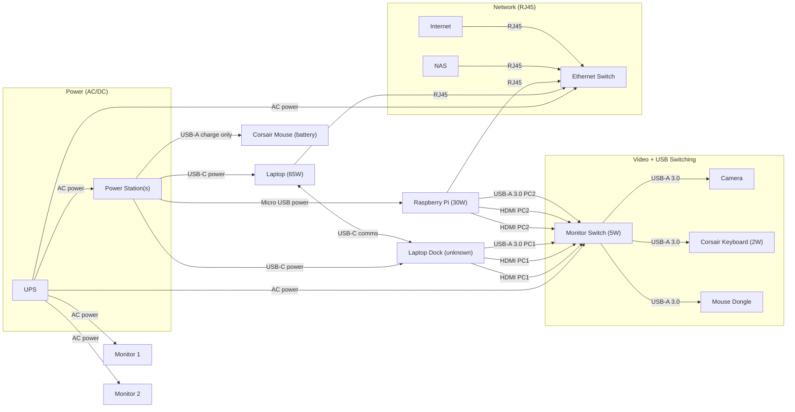

# Bill of Materials

| Qnty | Description | Unit | Price |
|------|-------------|------|-------|
|   2  | [WD Red Plus 10TB NAS Drive](https://www.amazon.co.uk/dp/B0FPDHLHML/?coliid=I2X71PO10MR97X&colid=VW7CRXVOSJBD)       | 220 | 440  |
|   1  | [SYNOLOGY 4-Bay DS925+ NAS](https://www.amazon.co.uk/dp/B0C8S7SF4B/?coliid=I8NKTNDONUBGG&colid=VW7CRXVOSJBD)         | 565 | 565  |
|   4  | [Ethernet Cable 1M](https://www.amazon.co.uk/dp/B0DB4M1KVY/?coliid=I3R2JN2H72GK8F&colid=VW7CRXVOSJBD)                | 8   | 32   |
|   1  | [SODOLA 5 Port 10Gb Switch](https://www.amazon.co.uk/dp/B0FNQZ63S5/?coliid=I1K6XXIBKS51V8&colid=VW7CRXVOSJBD)        | 160 | 160  |
|   1  | [800W USB C Charging](https://www.amazon.co.uk/Charging-Station-10%E2%80%91Port-Multiport-Compatible/dp/B0FKMGC4Q7/) | 50  | 50   |
|   1  | [Docking Station](https://www.amazon.co.uk/gp/product/B0BDDW8P9Q/?th=1)                                              | 187 | 187  |
|   1  | [900W UPS](https://www.amazon.co.uk/SKE-Battery-Protector-Computer-Uninterruptible/dp/B0CKW2RS7W)                    | 140 | 140  |