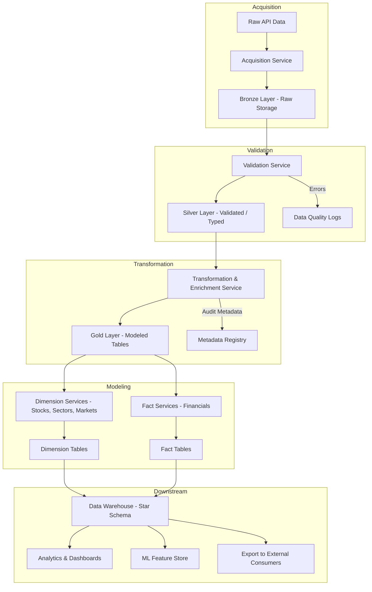

## Data Warehouse Pipeline 

To support reliable analytics and modeling on quarterly financial data, we’ve designed a robust, layered data pipeline based on medallion architecture principles. This pipeline ingests raw API data, validates and enriches it, and ultimately transforms it into star-schema fact and dimension tables within a central data warehouse. The diagram below outlines each major stage of the pipeline, followed by a detailed breakdown of its components and responsibilities.

 **Acquisition**

* **Raw API Data**: Quarterly financial data is fetched directly from a third-party source (e.g., EDGAR, Alpha Vantage APIs).
* **Acquisition Service**: Handles pulling the data, logging source metadata (timestamp, ticker, etc.).
* **Bronze Layer – Raw Storage**: Stores unmodified, original data for traceability and reprocessing. Bronze retains raw API responses as JSON, while Silver/Gold use Parquet.

* **Sources**: Alpha Vantage APIs
* **Tools**: Python extract scripts in the acquisition folder
* **Storage**: Raw data stored as JSON
* **Orchestration**: Prefect DAGs 
* **Folder**: `acquisition`

| Table                         | Partition                        |
| ----------------------------- | -------------------------------- |
| BALANCE_SHEET                 | symbol                           |
| CASH_FLOW                     | symbol                           |
| DIVIDENDS                     | symbol                           |
| EARNINGS                      | symbol                           |
| INCOME_STATEMENT              | symbol                           |
| INSIDER_TRANSACTIONS          | symbol                           |
| OVERVIEW                      | -                                |
| TIME_SERIES_MONTHLY_ADJUSTED  | symbol                           |

**Validation**

* **Validation Service**: Applies schema checks, data typing, null handling, and basic cleanup.
* **Silver Layer – Validated/Typed**: Cleaned and standardized data; safe for transformation and modeling.
* **Data Quality Logs**: Captures issues like missing fields, type mismatches, or late/malformed data for auditing and alerting.

* **Sources**: Alpha Vantage APIs
* **Tools**: Python extract scripts in the acquisition folder and saves to the validation folder
* **Cleaning**: fill or impute missing values, dedupe records, standardize formats
* **Storage**: Formatted data (date/time, float, int, str) stored in parquet format
* **Orchestration**: Prefect DAGs 
* **Folder**: `validated`

| Table                         | Partition                        |
| ----------------------------- | -------------------------------- |
| BALANCE_SHEET                 | symbol                           |
| CASH_FLOW                     | symbol                           |
| DIVIDENDS                     | symbol                           |
| EARNINGS                      | symbol                           |
| INCOME_STATEMENT              | symbol                           |
| INSIDER_TRANSACTIONS          | symbol                           |
| OVERVIEW                      | -                                |
| TIME_SERIES_MONTHLY_ADJUSTED  | symbol                           |
 

**Transformation**

* **Transformation & Enrichment Service**: Derives new metrics (e.g., ROE, EBITDA margin), performs currency normalization, standardizes structures.
* **Gold Layer – Modeled Tables**: Fully enriched, analysis-ready data structured in a consistent format across companies.
* **Metadata Registry**: Logs lineage, transformations applied, column-level metadata, and audit trail for governance.

 **Modeling**

* **Dimension Services**: Creates entity reference tables—stocks, sectors, markets—using SCD logic where necessary.
* **Fact Services**: Builds tables containing numeric, time-series data like revenue, profit, cash flow, etc.
* **Dimension Tables**: Entities and descriptors (e.g., company names, sectors, geography).
* **Fact Tables**: Measures tied to dimensions and time (e.g., Q2 2025 revenue for MSFT).

* **Enrichment**: joins, aggregations, type conversions using python in the transformation folder
* **Feature engineering**: date parts, rolling statistics, column level calculators
* **Orchestration**: Prefect DAGs 
* **Ratios**:  
* **AlphaPulse**: profitability (ROA), growth, leverage, valuation (earnings yield), momentum, stability and a weighted composite
* **Dividend Safety**: payout ratios (earnings & FCF), leverage, coverage metrics, volatility, streaks, drawdowns and a composite safety score
* **Folder**: `transformed`

| Table                         | Partition                        |
| ----------------------------- | -------------------------------- |
| DIM_STOCK                     | -                                |
| FACT_QTR_FINANCIALS           | symbol                           |

* **Dimension = the “who/what/where/when” context.** Descriptive attributes (names, categories, hierarchies).
* **Fact = the “how many/how much” measurements.** Numeric metrics tied to a specific grain (event) and foreign keys to dimensions.

|             | **Dimension**                               | **Fact**                                                |
| ----------- | ------------------------------------------- | ------------------------------------------------------- |
| Role        | Describes context (nouns)                   | Stores measures/events (verbs, numbers)                 |
| Examples    | `dim_customer`, `dim_date`, `dim_security`  | `fact_sales`, `fact_trades`, `fact_price_daily`         |
| Columns     | Text/labels, hierarchies, surrogate keys    | Foreign keys to dims + numeric measures                 |
| Size/Change | Smaller, slowly changing (SCD1/2/etc.)      | Very large, mostly insert-only/appended                 |
| Grain       | One row per **entity** at its natural grain | One row per **event/observation** at the declared grain |
| Additivity  | Not applicable                              | Measures are additive, semi-additive, or non-additive   |

**How to tell which is which**

* If you’re asking **“by what/along what axis do I slice?”** → It’s a **dimension**.
* If you’re asking **“how many/how much did we…”** → It’s a **fact**.
* If it mostly holds **numbers you aggregate** (sum, avg, min/max) → **fact**.
* If it mostly holds **descriptions** (name, type, sector, category) → **dimension**.

**Example (stocks domain)**

* **Dimension:** `dim_stock` (ticker, company name, sector, currency, IPO date, …)
* **Fact:** `fact_price_daily` (ticker\_key, date\_key, open, high, low, close, volume)

**Nuances**

* **Factless fact tables:** no measures, just the occurrence of an event (e.g., a student attended a class).
* **Bridge tables:** handle many‑to‑many between facts and dimensions (e.g., trade ↔ multiple brokers).
* **Degenerate dimensions:** IDs sitting in the fact table itself (e.g., transaction\_id as a textual attribute).

**Data Warehouse – Star Schema**

* Combines fact and dimension tables into a star schema optimized for analytics, slicing/dicing, and time-series comparison.

**Downstream Consumption**

* **Analytics & Dashboards**: Power BI, Tableau, or custom Streamlit apps use this data for executive dashboards and KPI tracking.
* **ML Feature Store**: Provides cleaned, ready-to-use features to machine learning models (e.g., for scoring or prediction).
* **Export to External Consumers**: Enables pushing data to clients, partners, or reporting systems (e.g., CSVs, APIs, S3, etc.).

## Data Warehouse Build Checklist

Here’s a checklist you can use to audit and improve your process:

### Ingestion & Raw Storage

* [x] Ingests all raw API data in original schema
* [x] Stores raw data in append-only, immutable format
* [x] Captures source metadata (e.g. filing date, ticker, quarter)

### Validation & Data Quality

* [x] Performs schema validation (using Pandera, Pydantic, or similar)
* [x] Logs validation errors separately
* [x] Tracks % completeness, timeliness, and type coercions
* [x] Version-controls schema (especially for API changes)

### Silver Layer (Cleaned Data)

* [x] Applies typing, null handling, standard formatting
* [x] Retains data in source-native structure but cleaned
* [x] Adds metadata (timestamps, validation results, source ID)

### Transformation & Enrichment

* [x] Derives key ratios and standardized metrics (e.g., ROE, EPS)
* [x] Handles currency normalization (if needed)
* [x] Adds industry/sector tagging from a reference source
* [x] Tracks data lineage (what inputs produced which outputs)

### Gold Layer & Dimensional Modeling

* [x] Fact tables contain fully normalized, comparable metrics
* [x] Dimension tables track stock metadata with SCD2 history
* [x] All tables have surrogate keys and audit timestamps
* [x] Fact/dimension relationships conform to star schema

### Pipeline Architecture

* [x] All services are modular and composable
* [x] Pipeline orchestrated with DAG tool (Airflow, Dagster, Prefect)
* [x] Logs and metrics for each stage are centrally collected
* [x] Retry logic and alerting in place for failed steps

### Downstream Readiness

* [x] Tables are partitioned and indexed for fast queries
* [x] Supports both batch and real-time consumption
* [x] Has snapshots or slowly changing dimensions to support time travel
* [x] Feature store integration (optional but powerful for ML use)

