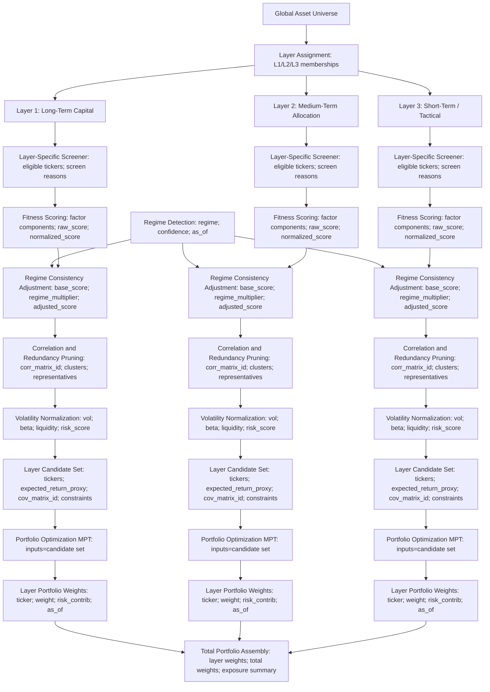

Below is a **formal AI context file**.
It is written to be **strict, declarative, and implementation-ready**, with minimal prose and clear contracts.
This is intended to be consumed by humans *and* used as a stable reference for code generation and system behavior.

---

# AI Context: Pyramid Strategy with Minsky Regime Allocation

## 0. Document Role

This document is the **authoritative behavioral contract** for the strategy system.

It defines:

* strategy composition,
* capital allocation rules,
* regime detection semantics,
* screener integration,
* risk and crisis behavior,
* evaluation and attribution requirements.

No implementation may contradict this document without an explicit versioned update.

---

## 1. Scope

### 1.1 Asset Classes

* Equities
* ETFs
* Bonds
* Options

### 1.2 Geography

* United States (initial)
* Architecture must support multi-geography expansion

### 1.3 Universe

* Single shared universe
* All filtering performed via screeners

---

## 2. Strategy Architecture

### 2.1 Top-Level Structure

The system is a **multi-strategy portfolio** organized as a **risk pyramid** and governed by **macro-financial regimes**.

```
Regime Detection
        ->
Capital Allocation
        ->
Pyramid Layers
        ->
Strategies
        ->
Selection Shaping
        ->
Portfolio Construction
        ->
Risk Controls
```

---

## 3. Pyramid Layers

### 3.1 Layer Definitions

| Layer     | Horizon    | Intent                             |
| --------- | ---------- | ---------------------------------- |
| Core      | Years      | Structural return, income, defense |
| Satellite | Months     | Opportunistic alpha, hedging       |
| Swing     | Days-Weeks | Tactical alpha, fast risk response |

### 3.2 Capital Targets (Normal Regime)

| Layer     | Target | Minimum Floor |
| --------- | ------ | ------------- |
| Core      | 60%    | 35%           |
| Satellite | 30%    | 5%            |
| Swing     | 10%    | 0%            |

Allocations may contract toward floors under adverse regimes.

---

## 4. Regime Detection (Minsky Model)

### 4.1 Regime States

The system recognizes four regimes:

* Hedge
* Speculative
* Ponzi
* Minsky Moment / Deleveraging

### 4.2 Data Sources

Allowed sources:

* Financial Modeling Prep (FMP)
* Bank for International Settlements (BIS)
* Federal Reserve Economic Data (FRED)

### 4.3 Signal Classes

* Structural leverage
* Credit expansion vs GDP
* Market-based stress
* Liquidity conditions
* Confirmatory stress indicators

### 4.4 Regime Output Contract

* Output is **probabilistic**
* Regime = probability vector across all states
* Allocation and constraints depend on:

  * dominant probability
  * probability trend
  * confirmation window

### 4.5 Regime Confirmation Rule

* Regime probability is evaluated daily
* A regime transition is accepted only if:

  * dominant regime probability remains dominant
  * for a configurable confirmation window (default: multi-week)
* Prevents allocation whipsaw

---

## 5. Regime Allocation Rules

| Regime        | Core       | Satellite | Swing    | Notes                |
| ------------- | ---------- | --------- | -------- | -------------------- |
| Hedge         | Overweight | Enabled   | Enabled  | Risk-on              |
| Speculative   | Neutral    | Capped    | Reduced  | Tight sizing         |
| Ponzi         | Defensive  | Min floor | Optional | Exposure throttled   |
| Minsky Moment | Min floor  | Min floor | Disabled | Capital preservation |

Regimes may also impose **universe and strategy restrictions**.

---

## 6. Strategy Catalog

### 6.1 Supported Strategy Types

The system supports (extensible):

* Trend-following ETF sleeve
* Factor / value equity sleeve
* Quality dividend sleeve
* Mean-reversion swing
* Momentum breakout swing
* Volatility targeting
* Crash hedge overlays

### 6.2 Strategy Input Contract

All strategies follow:

```
Universe
 -> Screeners
 -> Fitness Scoring
 -> Regime Adjustment
 -> Correlation Pruning
 -> Volatility Normalization
 -> Candidate Set
 -> Optimization (MPT when used)
 -> Target Weights
```


Each strategy must output:

* ranked securities
* fitness scores or expected return proxies
* candidate set constraints
* attribution metadata

Optimization outputs target weights when MPT is used.

### 6.3 Per-Layer Strategy Contracts

Each layer contract inherits the global strategy input contract (Section 6.2) and the selection shaping pipeline (Section 8).
Each layer strategy must define inputs, outputs, and constraints below.

**Core layer contract (years)**

Inputs:

* screened universe from Core-eligible screeners
* fitness factors focused on durability and compounding (ROIC stability, earnings variability, balance-sheet resilience, valuation dispersion vs history)
* regime state probability vector and confirmation status
* risk statistics (volatility, correlation) for candidate construction

Outputs:

* normalized fitness scores per security
* regime-adjusted scores
* candidate set with expected return proxies, volatility estimates, covariance reference, and constraints
* target weights when optimization or sizing is applied

Constraints and behavior:

* target allocation 60% with a 35% floor; obey Regime Allocation Rules
* rebalance quarterly
* max single name 5%; max positions 20-40
* in Minsky Moment, shift Core exposure to defensive assets

**Satellite layer contract (months)**

Inputs:

* screened universe from Satellite-eligible screeners
* fitness factors focused on trend persistence and quality (earnings revisions, trend strength, volatility-adjusted momentum, factor consistency)
* regime state probability vector and confirmation status
* risk statistics (volatility, correlation) for candidate construction

Outputs:

* normalized fitness scores per security
* regime-adjusted scores
* candidate set with expected return proxies, volatility estimates, covariance reference, and constraints
* target weights when optimization or sizing is applied

Constraints and behavior:

* target allocation 30% with a 5% floor; obey Regime Allocation Rules
* rebalance weekly
* max single name 7%; max positions 10-25
* in Ponzi regime, compress exposure toward floor; in Minsky Moment, hold at floor

**Swing layer contract (days-weeks)**

Inputs:

* screened universe from Swing-eligible screeners
* fitness factors focused on responsiveness (momentum acceleration, volatility regime fit, liquidity/tradability, mean-reversion exhaustion)
* regime state probability vector and confirmation status
* risk statistics (volatility, correlation) for candidate construction

Outputs:

* normalized fitness scores per security
* regime-adjusted scores
* candidate set with expected return proxies, volatility estimates, covariance reference, and constraints
* target weights when optimization or sizing is applied

Constraints and behavior:

* target allocation 10% with a 0% floor; obey Regime Allocation Rules
* rebalance daily
* max single name 3%; max positions 5-15
* in Minsky Moment, disable Swing exposure

---

## 7. Screener Framework

### 7.1 Screener Role

Screeners:

* score securities,
* rank the universe,
* output selection sets.

They **do not** allocate capital.
Selection shaping is handled in Section 8.

### 7.2 Initial Screener

* Quant Value screener
* Output:

  * ranked list
  * composite score
  * supports top X% or top N selection

### 7.3 Screener -> Layer Mapping (Initial)

| Screener    | Core | Satellite | Swing |
| ----------- | ---- | --------- | ----- |
| Quant Value | Yes  | Yes       | No    |

Rules:

* A security may appear in multiple layers
* Additional screeners must declare supported layers

---

## 8. Selection Shaping and Candidate Construction

This stage sits between screeners and optimization. It converts a screened universe into a ranked, risk-aware, regime-consistent candidate set.
Selection shaping is distinct from optimization.

### 8.1 Fitness Scoring (Layer-Specific)

Each layer must compute a composite fitness score per security.
The score expresses relative suitability within the layer and is not a return forecast or final weight.

Examples by layer:

* Core (years): ROIC stability, earnings variability, balance-sheet resilience, valuation dispersion vs history.
* Satellite (months-quarters): earnings revisions, trend strength, volatility-adjusted momentum, factor consistency.
* Swing (days-weeks): momentum acceleration, volatility regime fit, liquidity/tradability, mean-reversion exhaustion.

Outputs:

* fitness score per security per layer
* scores normalized within the layer universe

### 8.2 Regime Consistency Adjustment

Fitness scores must be adjusted by regime-aware multipliers derived from the Minsky regime state.
Soft gates are required (down-rank/penalize) rather than hard exclusions.

Examples:

* Hedge: higher leverage tolerance; growth exposure allowed.
* Speculative: penalize refinancing dependence and fragile balance sheets.
* Ponzi: strongly down-rank cyclicals, high debt, weak cash coverage.

### 8.3 Correlation and Redundancy Pruning

Before optimization:

* cluster candidates by return correlation
* limit representation per cluster
* prefer highest fitness score within each cluster

### 8.4 Volatility Normalization

Before optimization:

* estimate expected volatility per asset
* normalize or cap extreme volatility inputs

Volatility normalization keeps optimization focused on risk-adjusted opportunity rather than minimizing volatility alone.

### 8.5 Candidate Set Handoff to Optimizer

For each layer, construct a bounded candidate set (e.g. 20-60, layer-dependent) with:

* expected return proxy derived from fitness score
* volatility estimate
* correlation/covariance matrix reference
* layer constraints (max weight, sector caps, turnover)

Modern Portfolio Theory (MPT) optimization consumes this candidate set only; it does not alter screening or scoring logic.

Responsibility split:

* Screeners decide eligibility.
* Selection shaping decides desirability.
* Optimization decides allocation.

### 8.6 Pipeline Diagram (Reference)



---

## 9. Portfolio Construction

Portfolio construction consumes candidate sets from Section 8 and produces layer weights. When Modern Portfolio Theory (MPT) optimization is used, expected return proxies are derived from fitness scores.

### 9.1 Position Sizing

Sizing is **layer-specific and swappable**.

Supported sizing methods:

* Equal weight
* Score-proportional
* Volatility targeting
* Risk parity (intra-layer)

Sizing may be modified by:

* regime multipliers
* risk controls

### 9.2 Rebalance Cadence

| Layer     | Cadence   |
| --------- | --------- |
| Core      | Quarterly |
| Satellite | Weekly    |
| Swing     | Daily     |

### 9.3 Execution Assumptions

* End-of-day only
* No intraday execution
* Slippage modeled externally

---

## 10. Portfolio Constraints (Defaults)

Initial recommended constraints:

* Max single name:

  * Core: 5%
  * Satellite: 7%
  * Swing: 3%
* Max sector exposure: 25%
* Max gross exposure: 110%
* Max positions:

  * Core: 20-40
  * Satellite: 10-25
  * Swing: 5-15

All constraints must be configurable.

---

## 11. Risk Management Framework

### 11.1 Risk Controls

Risk controls are **modular** and may apply at:

* portfolio level
* layer level
* strategy level

Examples:

* max drawdown
* volatility caps
* exposure throttles
* forced deleveraging

### 11.2 Crisis Behavior (Minsky Moment)

When Minsky Moment probability breaches threshold:

* Core shifts to defensive assets
* Satellite compressed to floor
* Swing disabled
* Hedging overlays enabled

Exact behaviors are rule-driven and extensible.

---

## 12. Observability & Evaluation

### 12.1 Primary KPIs

Initial metrics:

* CAGR
* Sharpe ratio
* Sortino ratio
* Maximum drawdown

Framework must support metric expansion.

### 12.2 Attribution Requirements

First-class attribution required for:

* PnL by layer
* Risk contribution by layer
* PnL by strategy
* Performance by regime

---

## 13. Design Constraints

* Regime-aware, not forecast-based
* Capital preservation dominates late-cycle
* Screeners separated from allocation
* Selection shaping separated from optimization
* Extensibility over optimization
* Deterministic behavior preferred over heuristic tuning

---

If you want, the next step can be:

* extracting this into **machine-readable config blocks** (YAML/JSON),
* or deriving **per-layer strategy contracts** (inputs, outputs, invariants),
* or formalizing **regime probability -> allocation math**.


---
