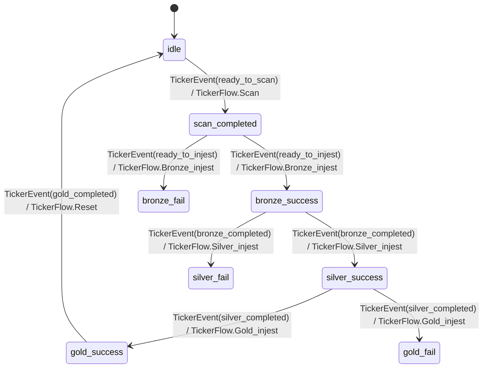

```mermaid
stateDiagram-v2
    [*] --> idle

    %% --- Scan stage ---
    
    idle --> scan_completed: TickerEvent(ready_to_scan) / TickerFlow.Scan

    %% --- Bronze stage ---
    scan_completed --> bronze_success: TickerEvent(ready_to_injest) / TickerFlow.Bronze_injest
    scan_completed --> bronze_fail: TickerEvent(ready_to_injest) / TickerFlow.Bronze_injest

    %% --- Silver stage ---
    bronze_success --> silver_success: TickerEvent(bronze_completed) / TickerFlow.Silver_injest
    bronze_success --> silver_fail: TickerEvent(bronze_completed) / TickerFlow.Silver_injest

    %% --- Gold stage ---
    silver_success --> gold_success: TickerEvent(silver_completed) / TickerFlow.Gold_injest
    silver_success --> gold_fail: TickerEvent(silver_completed) / TickerFlow.Gold_injest


    %% --- Optional terminal on full success ---
    gold_success --> idle: TickerEvent(gold_completed) / TickerFlow.Reset
```

