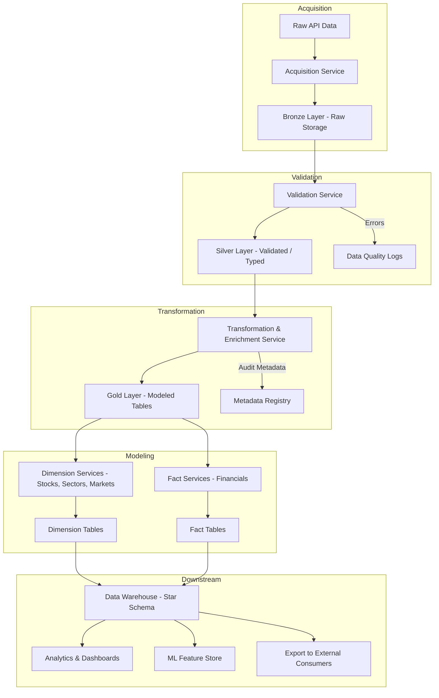

## Data Warehouse Pipeline

To support reliable analytics and modeling on quarterly financial data, we’ve designed a robust, layered data pipeline based on medallion architecture principles. This pipeline ingests raw API data, validates and enriches it, and ultimately transforms it into star-schema fact and dimension tables within a central data warehouse. The diagram below outlines each major stage of the pipeline, followed by a detailed breakdown of its components and responsibilities.



### Acquisition

* **Sources**: Alpha Vantage APIs, EDGAR
* **Tools**: Python extract scripts in the acquisition folder
* **Storage**: Raw data stored as JSON. Bronze retains raw API responses as JSON, while Silver/Gold use Parquet.
* **Orchestration**: Prefect DAGs
* **Folder**: `acquisition`

| Table                           | Partition |
| ------------------------------- | --------- |
| BALANCE\_SHEET                  | symbol    |
| CASH\_FLOW                      | symbol    |
| DIVIDENDS                       | symbol    |
| EARNINGS                        | symbol    |
| INCOME\_STATEMENT               | symbol    |
| INSIDER\_TRANSACTIONS           | symbol    |
| OVERVIEW                        | -         |
| TIME\_SERIES\_MONTHLY\_ADJUSTED | symbol    |

### Bronze Tier: Code & Structure

```python
class AlphaVantageFetcher:
    def fetch(self, ticker: str, endpoint: str) -> dict: ...

class BronzeIngestor:
    def write_json(self, ticker: str, data: dict, table: str): ...
    def log_status(self, ticker: str, table: str, status: str, error: str = None): ...
```

```
acquisition/
├── services/
│   ├── fetcher.py
│   └── ingestor.py
├── tickers.csv
└── bronze/
    └── earnings/2025-08-03/AAPL.json
```

### Validation

* **Folder**: `validated`
* **Tools**: Pandera / Pydantic, standardize formats
* **Storage**: Formatted parquet

```python
class FinancialDataValidator:
    def validate(self, df: pd.DataFrame, table: str) -> pd.DataFrame: ...
    def log_issues(self, df: pd.DataFrame, ticker: str, table: str): ...
```

```python
schema = DataFrameSchema({
    "symbol": Column(str),
    "fiscalDateEnding": Column("datetime64[ns]"),
    "reportedEPS": Column(float, Check.ge(0.0)),
})
```

```
validated/
├── services/validator.py
└── silver/income_statement/symbol=AAPL/part-000.parquet
```

### Transformation & Enrichment

* **Folder**: `transformed`
* **Ratios**: ROE, EBITDA margin, payout ratio, earnings yield, drawdowns
* **Orchestration**: Prefect DAGs

```python
class FinancialCurator:
    def merge_sources(self, data: Dict[str, pd.DataFrame]) -> pd.DataFrame: ...
    def compute_ratios(self, df: pd.DataFrame) -> pd.DataFrame: ...
    def write_fact_dim_tables(self, df: pd.DataFrame): ...

class DividendSafetyScorer:
    def score(self, df: pd.DataFrame) -> pd.DataFrame: ...
```

```
transformed/
├── services/curator.py
├── scorers/dividend_safety.py
└── gold/{dim_stock, fact_qtr_financials}/
```

### Prefect DAG Example

```python
@flow
def nightly_pipeline():
    acquire()
    validate()
    transform()
```

### Status Tracking (UI)

```python
status_table = pd.DataFrame([
    {"ticker": "AAPL", "layer": "bronze", "status": "success", "timestamp": "..."},
    {"ticker": "AAPL", "layer": "silver", "status": "fail", "error": "Missing field"},
])
```

```
status/status.parquet
```

### Project Layout

```
strawberry/
├── acquisition/
├── validated/
├── transformed/
├── status/
├── config/
│   ├── tickers.csv
│   └── settings.yaml
├── dags/nightly_pipeline.py
├── ui/streamlit_app.py
└── tests/
```

### Final Recommendations

| Area           | Recommendation                              |
| -------------- | ------------------------------------------- |
| Validation     | Use Pandera schemas                         |
| Lineage        | Add column-level hashes                     |
| Metadata       | Track source to metric lineage              |
| Enrichment     | Isolate calculations into modular scorers   |
| Retry/Backfill | Allow reprocessing by symbol/date           |
| Partitioning   | Partition all tables by `symbol`, `quarter` |
| Status UI      | Use Streamlit to monitor pipeline health    |
